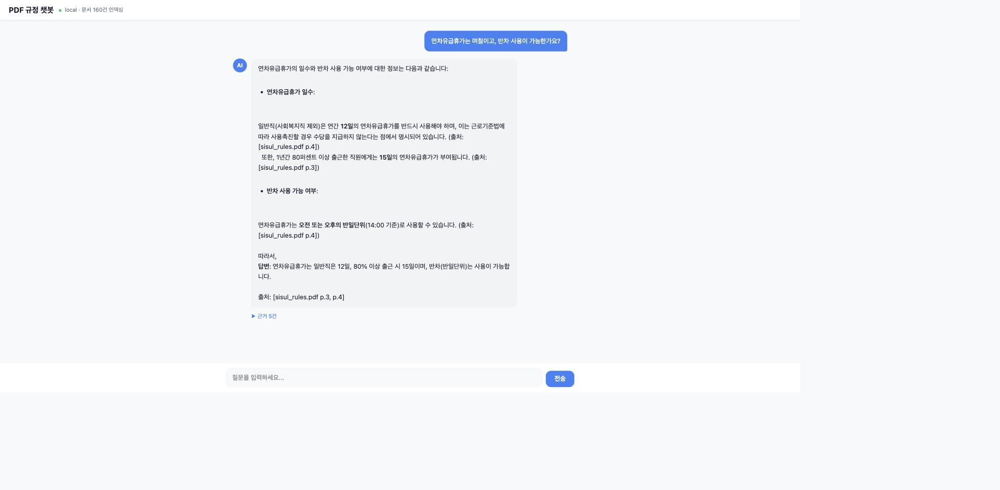

# PDF 규정 챗봇 + MCP 서버

[인사ON](../chat_bot_insaon/)에서 공개 공무원 인사 법령으로 검증한 PDF 추출·청킹·검색·출처 반환 계층을 범용화한 **PDF-to-Bot MCP 초안**입니다. 임의의 PDF 문서를 문자 2-gram 방식으로 검색하고, 결과를 MCP stdio 도구로 제공해 Claude Code가 근거 기반 답변에 활용할 수 있게 했습니다.

이 프로젝트는 별도의 토이 챗봇이 아니라, 인사ON의 도메인 특화 구현을 다른 사내 규정·매뉴얼·업무 문서에도 적용할 수 있는 형태로 확장한 결과입니다. 웹 채팅 UI도 함께 제공하며, 선택적으로 Ollama를 연결해 독립적인 자연어 답변을 생성할 수 있습니다.



## 핵심 사용 흐름

```text
Claude Code
    │ MCP / stdio
    ▼
mcp_server.py
    ├─ search_documents  ── PDF 검색 결과와 출처 반환 (주요 MCP 도구)
    └─ ask_documents     ── 검색 후 Ollama로 답변 생성 (선택 기능)
                              │
PDF → 텍스트 추출 → 청킹 → 문자 2-gram 인덱스
```

```text
인사ON
공개 법령으로 사내 규정 챗봇의 핵심 위험을 선행 검증
   ↓ 검증한 검색 계층 분리·범용화
PDF-to-Bot MCP
사용자 PDF를 Claude Code가 검색할 수 있는 도구로 노출
```

`search_documents`가 주요 MCP 도구입니다. Claude Code가 관련 PDF 청크와 출처를 받아 직접 판단하고 답변할 수 있습니다. `ask_documents`는 Claude가 다시 로컬 LLM을 호출하는 필수 경로가 아니라, Ollama만으로도 독립적인 RAG 답변을 만들고 싶을 때 사용하는 선택 도구입니다.

## MCP 도구

| 도구 | 역할 | 외부 의존성 |
|---|---|---|
| `search_documents(query, top_k=5)` | 관련 청크, 파일명, 페이지, 점수를 반환 | 없음 |
| `ask_documents(question)` | 검색 결과를 근거로 자연어 답변 생성 | Ollama 선택 |

`top_k`는 MCP 입력 스키마에서 **1~20**으로 제한됩니다. 범위를 벗어난 값은 도구가 실행되기 전에 validation 오류로 거부됩니다.

## 설치

Python 3.12 이상이 필요합니다.

```bash
python3 -m venv .venv
.venv/bin/python -m pip install -e .

# 검색할 PDF 추가
cp 회사_인사규정.pdf documents/
```

`documents/`의 PDF는 Git에 포함되지 않도록 설정되어 있습니다. 공개 가능한 샘플 문서만 별도로 배포하세요.

## Claude Code 연결

프로젝트 공유 설정은 루트의 [`.mcp.json`](.mcp.json)에 들어 있습니다. `.claude/settings.json`의 `mcpServers`는 사용하지 않습니다.

1. 이 프로젝트 루트에서 `claude`를 실행합니다.
2. `/mcp`를 열어 `pdf-chatbot` 프로젝트 서버를 한 번 승인합니다.
3. 상태가 `Connected`이고 도구 2개가 표시되는지 확인합니다.
4. Claude에게 `search_documents`를 사용해 규정 질문에 답하도록 요청합니다.

```text
search_documents("연차휴가 기간", top_k=3)
```

`.mcp.json`은 `${CLAUDE_PROJECT_DIR:-.}`를 사용하므로 실행 위치가 달라져도 프로젝트의 Python 환경, 서버 파일, 문서 폴더를 가리킵니다. 프로젝트 MCP 서버는 최초 사용 시 사용자 승인이 필요합니다.

## MCP Inspector 검증

도구 노출 확인:

```bash
npx -y @modelcontextprotocol/inspector --cli \
  .venv/bin/python mcp_server.py \
  --method tools/list --format json
```

도구 호출 확인:

```bash
npx -y @modelcontextprotocol/inspector --cli \
  .venv/bin/python mcp_server.py \
  --method tools/call \
  --tool-name search_documents \
  --tool-args-json '{"query":"연차휴가","top_k":3}' \
  --format json
```

### 2026-08-21 재현 테스트

| 검증 | 결과 |
|---|---|
| 패키지 설치 `pip install -e ".[dev]"` | 성공 |
| 자동 테스트 `pytest -q` | **3 passed** |
| Inspector stdio 연결 | 성공 |
| `tools/list` | `search_documents`, `ask_documents` 노출 |
| 임시 PDF `search_documents` 호출 | `rules.pdf` p.1, score `0.7568` 반환 |
| `top_k=-1` 호출 | validation 오류, `isError: true` |
| Claude Code 프로젝트 설정 인식 | 성공, 최초 사용자 승인 대기 상태 확인 |

검증용 PDF는 테스트 중 임시로 생성했으며 저장소에는 포함하지 않았습니다. 실제 회사 규정에 대한 정답성이나 검색 품질을 보증하는 결과는 아닙니다.

## 자동 테스트

```bash
.venv/bin/python -m pip install -e ".[dev]"
.venv/bin/python -m pytest -q
```

테스트는 다음을 확인합니다.

- MCP 서버가 두 도구를 노출하는지
- `top_k`의 minimum/maximum이 입력 스키마에 포함되는지
- PDF 청크 검색 결과가 출처와 함께 반환되는지
- `top_k`가 1~20 범위를 벗어나면 거부되는지

## 웹 채팅 실행

```bash
# Ollama 없이 검색 결과만 표시
.venv/bin/python run.py --profile offline

# Ollama 자연어 답변 사용
ollama serve
ollama pull qwen3:4b-instruct
.venv/bin/python run.py --profile local
```

## 검색 품질

공개 인사규정 3건(서울시설관리공단, K-water, ISDC)을 사용한 기존 실험 기록입니다.

| 지표 | 결과 |
|---|---|
| 인덱싱 | 3 PDF → 160개 청크 |
| Precision@3 | 10/10 (100%) |
| 엣지 케이스 | 빈 쿼리·비관련 쿼리·빈 폴더 안전 처리 |

<details>
<summary>기존 테스트 쿼리 10건</summary>

| 쿼리 | top-1 출처 | score |
|---|---|---|
| 육아휴직 기간 | kwater_hr.pdf p.9 | 0.405 |
| 연차휴가 일수 | sisul_rules.pdf p.3 | 0.297 |
| 징계 종류 | isdc_hr.pdf p.15 | 0.293 |
| 수습기간 | isdc_hr.pdf p.23 | 0.336 |
| 승진 자격 요건 | isdc_hr.pdf p.6 | 0.207 |
| 퇴직 정년 | sisul_rules.pdf p.8 | 0.308 |
| 복직 절차 | kwater_hr.pdf p.10 | 0.204 |
| 전보 인사이동 | kwater_hr.pdf p.1 | 0.174 |
| 보수 급여 | sisul_rules.pdf p.7 | 0.150 |
| 채용 방법 | isdc_hr.pdf p.3 | 0.397 |

</details>

위 결과는 저장소에 포함되지 않은 당시 평가 문서 기준 기록입니다. 재현하려면 동일 문서와 평가 쿼리가 필요합니다.

## 파일 구조

```text
.mcp.json          Claude Code 프로젝트 MCP 설정
mcp_server.py      stdio MCP 서버와 도구 정의
search.py          문자 2-gram 검색
ingest.py          PDF 텍스트 추출과 청킹
ollama.py          선택적 Ollama 클라이언트
app.py             FastAPI 웹 챗봇
run.py             웹 실행기
templates/         웹 UI
documents/         로컬 PDF 폴더(Git 제외)
tests/             MCP 도구와 입력 검증 테스트
```

## 환경변수와 보안

- `.env`, `.env.*`, PDF, 로그, ZIP, macOS 메타데이터는 Git에서 제외됩니다.
- `.env.example`에는 비밀값이 없으며, 선택적인 `PDF_CHATBOT_DOCS` 경로만 설명합니다.
- `.env`는 애플리케이션이 자동으로 읽지 않습니다. 직접 실행할 때 필요한 값은 환경변수로 전달하세요.
- API 키나 회사 내부 문서는 저장소와 `.mcp.json`에 직접 넣지 마세요.

## 한계

- 문자 2-gram 기반이므로 의미가 같지만 표현이 다른 질문에는 약할 수 있습니다.
- 페이지/단락 단위 청킹이라 조문 경계가 부정확할 수 있습니다.
- `ask_documents`는 로컬 모델 성능과 속도에 영향을 받으며 기본 모델 기준 응답이 느릴 수 있습니다.
- 대화 맥락을 저장하지 않아 매 질문을 독립적으로 검색합니다.
- 기존 검색 품질 기록은 동일한 원본 PDF 없이는 완전 재현되지 않습니다.

[chat_bot_insaon](../chat_bot_insaon/)은 조건 추출, 시점 필터, 규칙 엔진 등 도메인 로직을 포함합니다. 이 프로젝트는 PDF를 넣고 바로 사용하는 범용 검색과 MCP 연결에 집중합니다.
