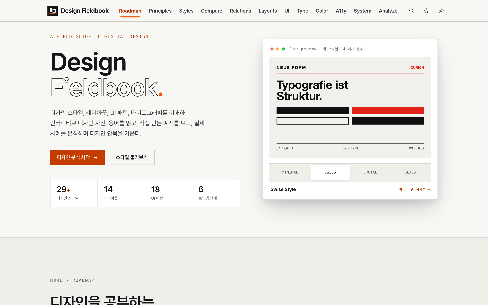
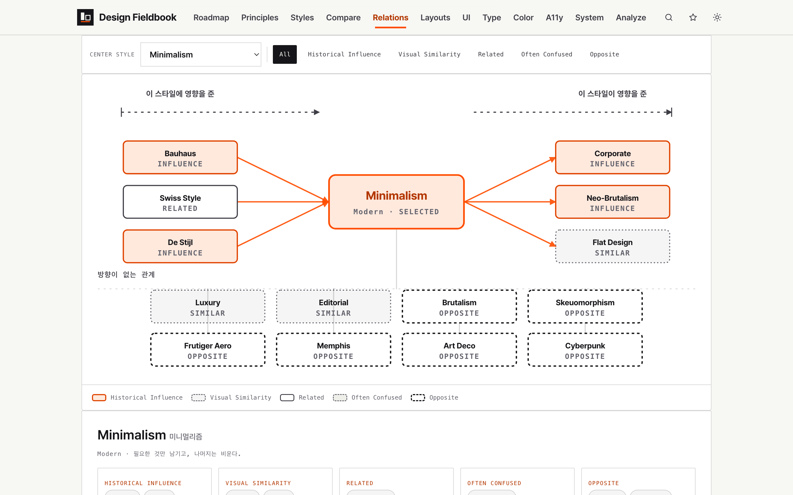
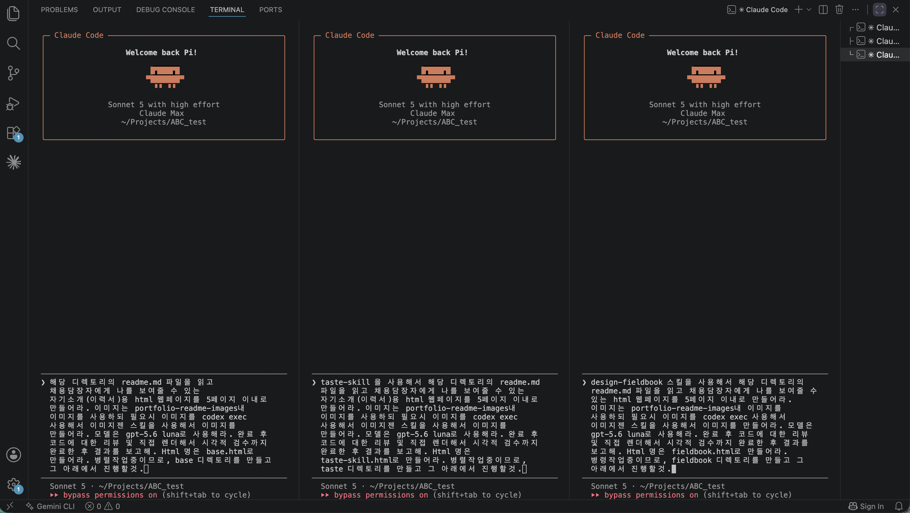
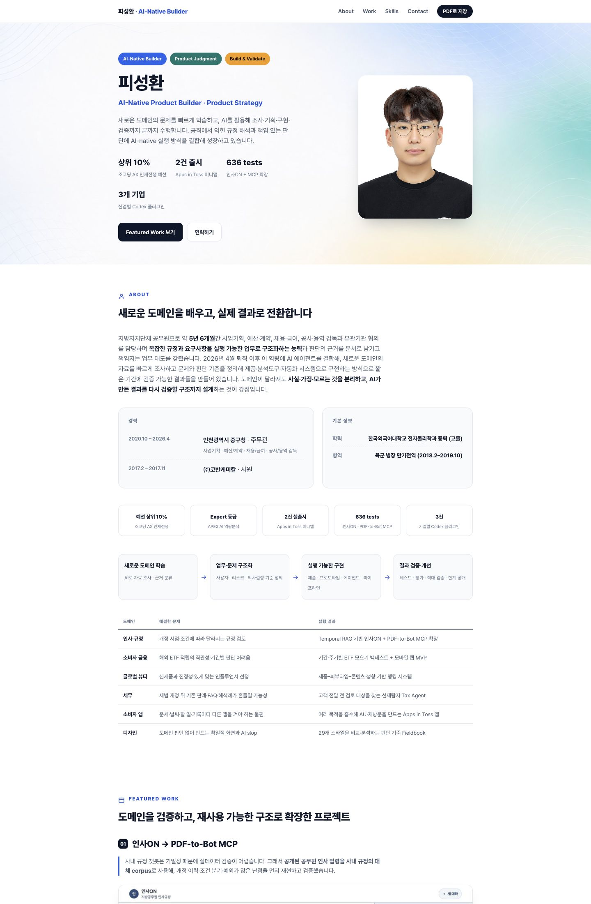
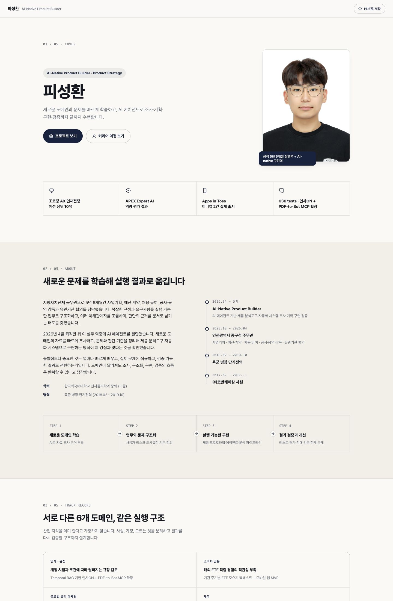
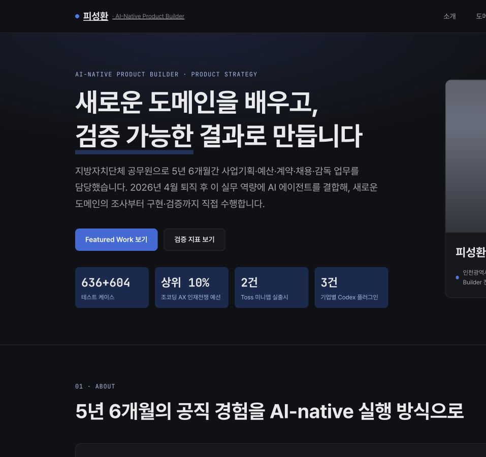
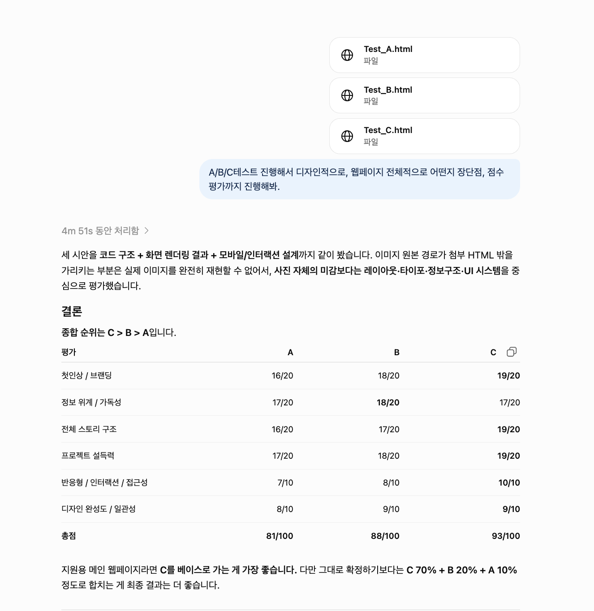
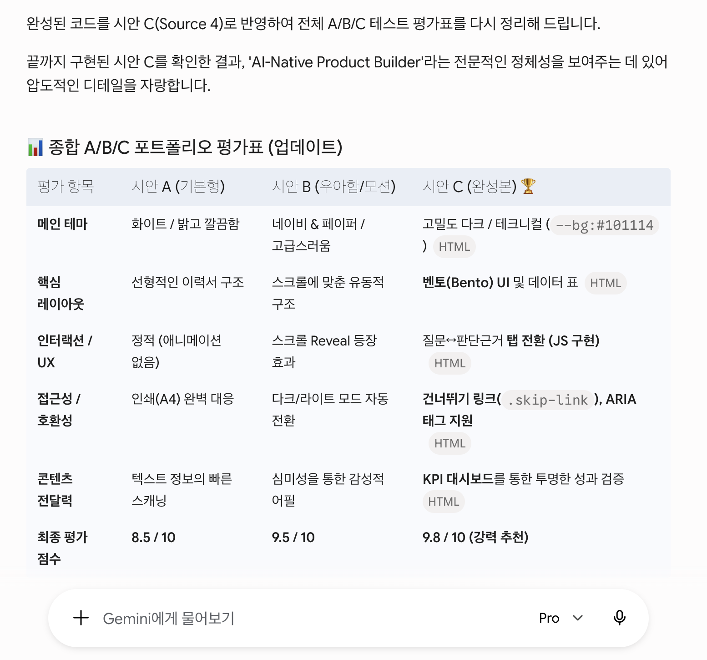

# Design Fieldbook Skill — 디자인 지식을 실행 가능한 AI 작업 방식으로

AI가 화면을 빠르게 생성하더라도 디자인 도메인 지식과 평가 기준이 부족하면 비슷한 카드, 그라디언트, 과도한 둥근 모서리와 장식으로 수렴하기 쉽습니다. 이를 줄이기 위해 먼저 만든 **Design Fieldbook 웹사이트의 학습·비교 체계**를, AI 에이전트가 실제 디자인 작업에서 반복 사용할 수 있는 스킬로 가공했습니다.

> 디자인 자료를 요약한 프롬프트 모음이 아니라, **방향 판단 → 이미지 시안 비교·주입 → 디자인 토큰 계산 → 구현 → 독립 미적 검토 → 코드·렌더링 검증**을 하나의 작업 흐름으로 강제하는 실행 시스템입니다.

**기반 프로젝트:** [Design Fieldbook 웹사이트](https://design-study-three.vercel.app/)  
**스킬 진입점:** [`SKILL.md`](SKILL.md)

| Design Fieldbook 홈 | 스타일 비교 | 관계 지도 | 디자인 시스템 감사 |
|---|---|---|---|
|  |  |  |  |

## 이 스킬의 핵심 차별점

| 차별점 | 실제 동작 |
|---|---|
| **TPO를 수치로 판정** | 판돈·문장 어조·정보 밀도·장르를 먼저 분류하고, `절제·중립·임팩트`별 액센트 크로마와 사용 면적 범위를 확정합니다. |
| **코딩 전에 이미지로 방향을 선택** | 같은 콘텐츠로 전체 페이지 시안 3장을 생성·비교하고, 선택한 이미지에서 톤앤매너와 레이아웃 관계를 추출해 구현 레퍼런스로 주입합니다. |
| **틀린 토큰은 생성하지 않음** | `tokens.py`가 대비·크로마·배경/표면 차이·타입 스케일·여백 배율을 출력 전에 실측합니다. 기준을 만족하지 못하면 잘못된 CSS를 내보내지 않고 종료합니다. |
| **계획을 검증 가능한 계약으로 저장** | HTML의 `/* plan */`에 톤·장르·스타일·레이아웃·모션·이미지 결정을 남기고, `verify.py`가 선언과 실제 CSS의 불일치를 검사합니다. |
| **디자인 검수용 서브에이전트** | 화면을 제작한 에이전트와 분리된 fresh context의 서브에이전트가 실제 화면만 보고 미적 결함을 검토합니다. 검토 결과가 없거나 결함이 남아 있으면 다음 단계로 넘어갈 수 없습니다. |
| **Python 코드로 규칙 강제** | `tokens.py`·`verify.py`·`render_audit.py`·`gate.py`가 토큰 생성, 계획–CSS 일치, 실제 렌더링, 검수 순서를 강제합니다. 검토 파일에는 HTML SHA-256을 묶어 수정 전 통과 기록의 재사용도 차단합니다. |
| **상태를 기억하는 수렴 루프** | `gate.py`가 `.gate-history.json`에 회차별 결과를 저장하고 `신규·잔존·해결·재발`로 구분합니다. 미적 결함이나 코드 FAIL이 남으면 구현 단계로 되돌아가며, 같은 결함이 3회 이상 남거나 재발하면 토큰·규칙·레이아웃 설계를 바꾸도록 요구합니다. |
| **브라우저에 그려진 결과를 측정** | `render_audit.py`가 1440·1100·768·500·390px에서 실제 computed style과 geometry를 읽습니다. CLI 한계 이하인 390px는 iframe에 가둬 미디어쿼리까지 검증합니다. |

즉, “이 규칙을 참고하세요”라고 조언하는 스킬이 아니라 **좋지 않은 판단이 그대로 완료 처리되는 경로를 단계별로 차단하는 스킬**입니다.

## 출발점 — 웹사이트에서 스킬로

Design Fieldbook 웹사이트에서는 디자인 원칙과 스타일을 글로만 설명하지 않고, 같은 콘텐츠를 서로 다른 방식으로 직접 렌더링해 비교할 수 있도록 만들었습니다.

- 디자인 스타일 29개
- 레이아웃 14개
- UI 패턴 18개
- Bad/Good 비교와 실제 DOM·CSS 예시
- 타이포그래피, 컬러, 접근성, 디자인 시스템, 모션 판단 기준
- 스타일 관계 지도 29개 × 필터 6개, 총 174개 조합 검증

하지만 웹사이트는 사람이 학습하고 비교하는 도구입니다. AI가 실제 작업 중 이 지식을 안정적으로 사용하려면 “읽어두면 좋은 이론”이 아니라, 어떤 상황에서 어떤 자료를 읽고 무엇을 결정하며 언제 작업을 멈춰야 하는지가 명시된 절차가 필요했습니다.

여기서 바로 규칙을 쓰지 않고 AI에게 여러 장르의 화면을 반복해서 만들게 했습니다. 그 결과 **크기·간격·대비처럼 코드로 명시 가능한 규칙은 비교적 잘 따르지만**, 다음 문제는 지속적으로 남았습니다.

- CSS 선언은 맞아도 캐스케이드와 화면폭에 따라 실제 렌더링이 달라지는 문제
- 여백의 우선순위, 이미지 관련성, 카드 간 밀도처럼 수치만으로 판단하기 어려운 문제
- 화면을 만든 에이전트가 자신의 선택을 관대하게 평가하는 자기 검수 편향
- 한 번 고친 결함이 다음 회차에 다시 나타나는 문제

그래서 코드로 잡을 수 있는 실패는 Python 검사로 내리고, 화면에서만 보이는 실패는 실제 렌더링 검사로 옮겼습니다. 미적 판단은 제작자와 분리된 디자인 검수용 서브에이전트에 맡기고, 같은 실패가 되돌아오면 규칙과 토큰 층을 다시 고치는 상태형 루프로 연결했습니다. **스킬의 규칙은 이 테스트에서 AI가 계속 못한 부분을 반복해서 깎아낸 결과**입니다.

## 핵심 개선 — 이미지를 먼저 보고 디자인하게 만들기

사주 다이어리를 만들 때 AI가 디자인 방향을 안정적으로 잡지 못하는 문제를, 원하는 분위기와 구도를 담은 **이미지를 레퍼런스로 제공하는 방식**으로 해결한 경험이 있었습니다. 텍스트로 스타일 이름과 규칙을 길게 설명하는 것보다, 먼저 시각적 기준을 보여주고 그 관계를 구현하게 하는 편이 효과적이었습니다.

이 경험을 일회성 프롬프트 요령으로 두지 않고 Design Fieldbook의 정식 작업 단계로 옮겼습니다.

```text
콘텐츠와 목표 분석
  ↓
동일 콘텐츠로 전체 페이지 이미지 시안 3종 생성
  ↓
계획 적합성·스타일 커밋·레이아웃 다양성·AI slop을 비교
  ↓
시안 1종 선택 → 톤앤매너·레이아웃 관계를 구현 레퍼런스로 주입
  ↓
토큰 계산 → 코드 구현 → 독립 미적 검토 → 정적·렌더링 게이트
```

시안은 완성 화면을 그대로 복제하거나 페이지 안에 삽입하는 이미지가 아닙니다. **코드를 작성하기 전에 서로 다른 디자인 방향을 눈으로 비교하고 선택하기 위한 레퍼런스**이며, 대비·접근성·토큰 규칙과 충돌하면 이후 검증 게이트가 우선합니다.

## 동일 프롬프트 A/B/C 원샷 비교

같은 자기소개 콘텐츠와 입력 이미지, 동일한 프롬프트·모델·effort를 사용하고 스킬 적용 여부만 바꿔 원샷으로 생성했습니다.

| 단계 | 사용 환경 |
|---|---|
| 스킬 제작·개선 | Claude Code |
| A/B/C 결과 생성 | Claude Code · Sonnet 5 · High effort |
| 결과 검수 | GPT-5.6 · High / Gemini 3.1 Pro |

| A | B | C |
|---|---|---|
| 스킬 미사용 | GitHub [`taste-skill`](https://github.com/leonxlnx/taste-skill)<br>80.1k stars · 5.5k forks¹ | `Design Fieldbook Skill` |

¹ GitHub 공개 수치, 2026-08-25 확인.

<p align="center">
  
</p>

### 검수 결과 요약

완성된 A/B/C HTML은 **GPT-5.6 High와 Gemini 3.1 Pro**로 별도 검수했습니다. 점수 척도가 달라 평균은 내지 않았습니다.

| 검수 모델 | A — 스킬 미사용 | B — taste-skill | C — Design Fieldbook | 종합 순위 |
|---|---:|---:|---:|---|
| GPT-5.6 · High | 81/100 | 88/100 | **93/100** | **C > B > A** |
| Gemini 3.1 Pro | 8.5/10 | 9.5/10 | **9.8/10** | **C > B > A** |

두 모델 모두 C를 가장 높게 평가했습니다. 다만 GPT-5.6의 정보 위계·가독성 항목은 B 18점, C 17점이었습니다.

### A — 스킬 미사용

<p align="center">
  
</p>

밝은 히어로·인물 이미지·칩·카드가 결합된 익숙한 포트폴리오 랜딩 구조입니다.

### B — GitHub [taste-skill](https://github.com/leonxlnx/taste-skill)

<p align="center">
  
</p>

넓은 여백과 절제된 타이포그래피를 사용하는 에디토리얼·문서형 구성입니다.

### C — Design Fieldbook Skill

<p align="center">
  
</p>

대형 한글 헤드라인, 고대비 다크 표면, 성과 지표의 크기 차를 사용해 메시지와 증거의 위계를 강화한 구성입니다.

### 검수 원본

#### GPT-5.6 High

<p align="center">
  
</p>

#### Gemini 3.1 Pro

<p align="center">
  
</p>

단일 원샷의 정성평가이므로 일반적인 우위를 확정하지는 않습니다. 확인한 것은 **이미지로 방향을 비교·선택한 뒤 코드와 검증 루프에 연결하는 방식의 가능성**입니다.

→ [A/B/C 원본 HTML과 실험 조건 보기](experiments/abc-test/)

```text
Design Fieldbook 웹사이트
사람이 디자인 차이를 보고 배우는 인터랙티브 사전
        ↓ 판단 기준·실측값·실패 사례를 재구성
Design Fieldbook Skill
AI가 작업 중 필요한 지식만 불러와 설계하고 검증하는 실행 체계
```

## 스킬이 실제로 하는 일

### 1. 요청을 바로 스타일로 번역하지 않습니다

먼저 화면의 판돈, 문장 어조, 정보 밀도, 장르를 판정해 `절제·중립·임팩트` 중 하나를 고릅니다. “세련되게” 같은 모호한 표현 대신 액센트 크로마와 사용 면적을 수치 범위로 확정합니다.

### 2. 모든 참고자료를 한꺼번에 읽지 않습니다

작업에 필요한 챕터만 선택적으로 불러옵니다. 색을 정할 때는 `color.md`, 구조를 잡을 때는 `layout.md`, 스타일 후보를 고를 때는 해당 스타일 카테고리만 읽는 방식입니다.

### 3. 이미지 시안으로 방향을 먼저 고릅니다

마케팅 화면은 동일한 콘텐츠로 전체 페이지 시안 3장을 만들고, 계획 적합성·스타일 커밋·레이아웃 다양성·슬롭 여부를 비교해 하나를 선택합니다. 선택한 시안에서 색조와 레이아웃 관계만 추출하고, 실제 수치와 접근성 기준은 이후 토큰과 게이트로 다시 검증합니다.

### 4. 디자인 토큰을 감으로 고르지 않습니다

`tokens.py`가 시드 색과 톤을 받아 액센트 램프, 배경·표면·구분선, 타입 스케일, 여백 스케일을 계산합니다. 결과를 내보내기 전에 대비와 색상 범위도 함께 검사합니다.

```bash
python3 scripts/tokens.py '#6D5DFB' 절제
```

### 5. 구현 전에 계획을 산출물 안에 남깁니다

판단 결과를 HTML의 `/* plan */` 블록에 기록합니다. 이후 검증 스크립트가 계획과 실제 CSS가 일치하는지 확인하므로, 말로만 “절제된 디자인”이라고 선언하고 형광색을 사용하는 식의 불일치를 줄입니다.

### 6. 미적 판단과 코드 검증을 상태형 루프로 연결합니다

코드가 통과했다고 보기 좋은 화면은 아닙니다. 그래서 다음 순서를 고정했습니다.

```text
UI 구현
  ↓
독립 에이전트의 미적 검토 ── 결함 ──→ 수정 ──┐
  ↓ 통과                                      │
정적 검증 verify.py ───────── FAIL ───────────┤
  ↓ 0 FAIL                                    │
렌더링 검증 render_audit.py ─ FAIL·재발 ─────┘
  ↓ 0 FAIL
최종 스크린샷 확인 → 완료
```

독립 검토 결과는 `<html 이름>.feel-review.json`에 현재 HTML의 SHA-256과 함께 기록합니다. HTML을 수정하면 해시가 달라지므로 반드시 새 화면을 다시 검토해야 합니다. 코드 검사 통과 기록만 남겨두고 미적 검토를 건너뛸 수 없도록 만든 장치입니다.

루프는 매번 처음부터 같은 검사를 반복하는 구조가 아닙니다. `gate.py`가 이전 회차를 기억해 새로 생긴 결함, 계속 남은 결함, 해결된 결함, 해결됐다가 다시 나타난 결함을 나눕니다. 특히 **재발 또는 3회 이상 잔존은 해당 화면만 덧대지 않고 스킬의 규칙이나 설계 자체를 고쳐야 한다는 신호**로 처리합니다.

## 검증 범위

| 검증 도구 | 확인하는 내용 |
|---|---|
| `tokens.py` | 색 대비, 크로마 범위, 배경·표면 차이, 타입·여백 스케일 계산 |
| `verify.py` | 계획 선언, 접근성, 타입 스케일, 간격, 스타일 커밋, 모션·레이아웃 반복 등 정적 검사 |
| `render_audit.py` | 1440·1100·768·500·390px에서 오버플로, 실제 대비, 카드 높이, 터치 영역 등 렌더링 검사 |
| `gate.py` | 미적 검토 기록과 코드 검증을 정해진 순서로 실행하고 회차별 신규·잔존·해결·재발 결함 추적 |

검증 기준은 처음부터 완성된 것이 아닙니다. 코드 게이트를 통과했지만 화면이 무너졌던 사례, 수정한 결함이 다음 회차에 재발한 사례, 장르에 맞는 화면을 일률적인 규칙이 오탐한 사례를 다시 규칙과 스크립트에 반영하며 확장했습니다.

## 구성

```text
Design_Fieldbook_Skill/
├── SKILL.md                 # 작업 진입 순서와 공통 판단 기준
├── references/              # 디자인 원칙·컬러·타입·레이아웃·접근성·모션·이미지 시안
│   └── styles/              # 29개 스타일과 현대적 조합 프리셋의 구현 관계
├── scripts/
│   ├── tokens.py            # 프로젝트별 토큰 계산
│   ├── verify.py            # 정적 검증
│   ├── render_audit.py      # 실제 렌더링 검증
│   └── gate.py              # 전체 검증 루프와 상태 관리
├── demos/                   # 모션 이론과 동작 예제
├── probes/                  # 캠페인·대시보드·문서 장르 검증용 화면
└── docs/images/             # README 이미지
```

스킬 핵심부는 `SKILL.md`와 참고자료·스크립트·데모·프로브를 포함한 **29개 파일, 약 7,940줄**로 구성되어 있습니다.

Claude Code에서 실제로 사용할 때는 이 프로젝트 폴더의 내용을 프로젝트 또는 사용자 스킬 경로인 `.claude/skills/design-fieldbook/`에 복사하면 됩니다. 포트폴리오에서는 숨김 경로가 아닌 현재 폴더에 원본 전체를 공개합니다.

## 설계 판단

- 웹사이트의 실제 색상값을 그대로 복사하지 않고 역할 구조와 관계만 가져옵니다.
- 29개 스타일을 무작정 적용하지 않고 콘텐츠와 사용 맥락을 먼저 판정합니다.
- AI가 자주 만드는 범용 장식과 모션 패턴을 명시적으로 탐지합니다.
- 이미지 시안은 픽셀 복제 대상이 아니라, 구현 전에 방향을 선택하는 레퍼런스로만 사용합니다.
- 수치로 측정 가능한 문제와 사람이 봐야 하는 미적 문제를 분리합니다.
- 코드 게이트를 통과해도 독립적인 미적 검토가 끝나지 않으면 완료로 보지 않습니다.

## 현재 한계

- 미적 응집력은 완전 자동화할 수 없어 별도 에이전트나 사람의 검토가 필요합니다.
- 스타일 선택은 프로젝트의 실제 브랜드와 콘텐츠 맥락에 따라 달라집니다.
- 이미지 시안 단계를 실행하려면 이미지 생성이 가능한 Codex 환경 또는 별도의 이미지 생성 API가 필요합니다. 사용할 수 없으면 이 단계는 생략하고 기존 계획·토큰 흐름으로 진행합니다.
- 시안 3장을 생성·비교하므로 이미지 생성 비용과 대기 시간이 추가됩니다.
- 검증 스크립트는 HTML·CSS 중심이며, 프레임워크별 런타임 상태는 별도 확인이 필요합니다.
- 현재 A/B/C 비교는 동일 조건의 단일 원샷 사례이므로 통계적 우위를 의미하지 않습니다.
- GPT와 Gemini의 평가는 사람 대상 사용성 조사나 공식 벤치마크가 아닌, 이종 모델을 이용한 정성 검수 결과입니다.
- 방향 판단, 서브에이전트 검수, 정적·렌더링 검사와 수정 루프를 거치므로 단순 생성보다 시간이 오래 걸립니다. 빠른 초안보다 결과의 일관성과 재현성이 중요한 작업에 적합합니다.

## 현재 상태

첫 버전을 공개했습니다. 앞으로 실제 디자인 작업에서 반복적으로 확인되는 실패 사례를 수집해 규칙, 레퍼런스와 Python 검증 범위를 추가 보강할 예정입니다.

이 프로젝트의 목적은 AI가 디자인을 대신하도록 만드는 것이 아닙니다. **AI에게 어떤 디자인 판단을 맡길 수 있고, 무엇을 다시 검토해야 하는지 구분할 수 있는 작업 체계**를 만드는 것입니다.
