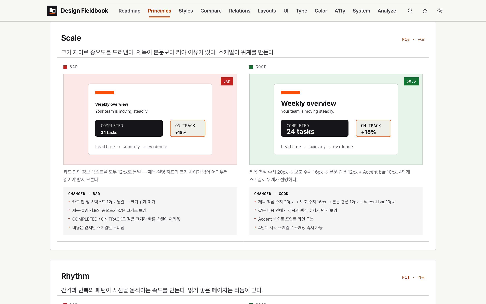
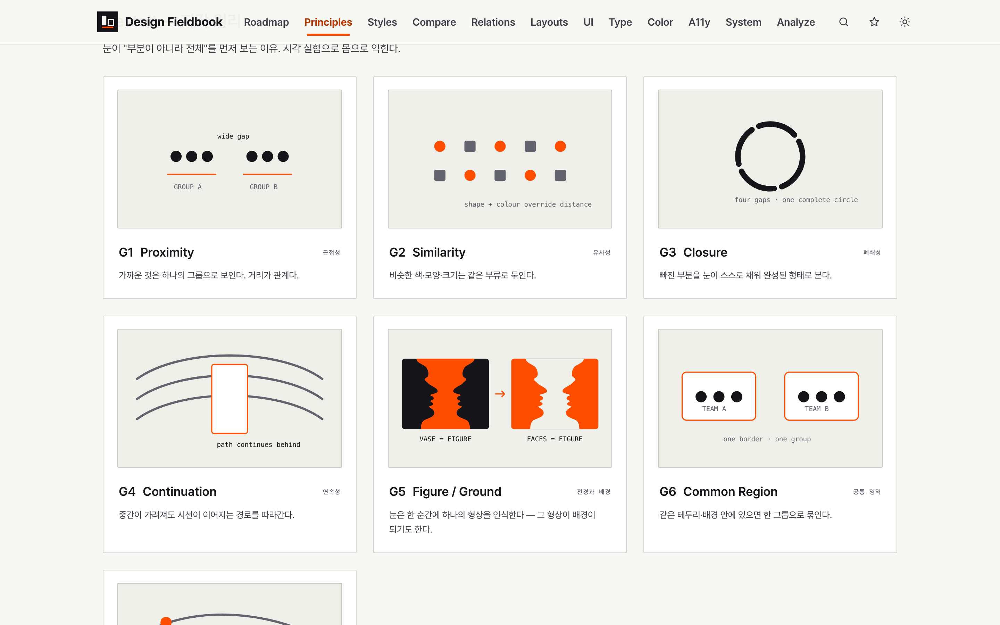
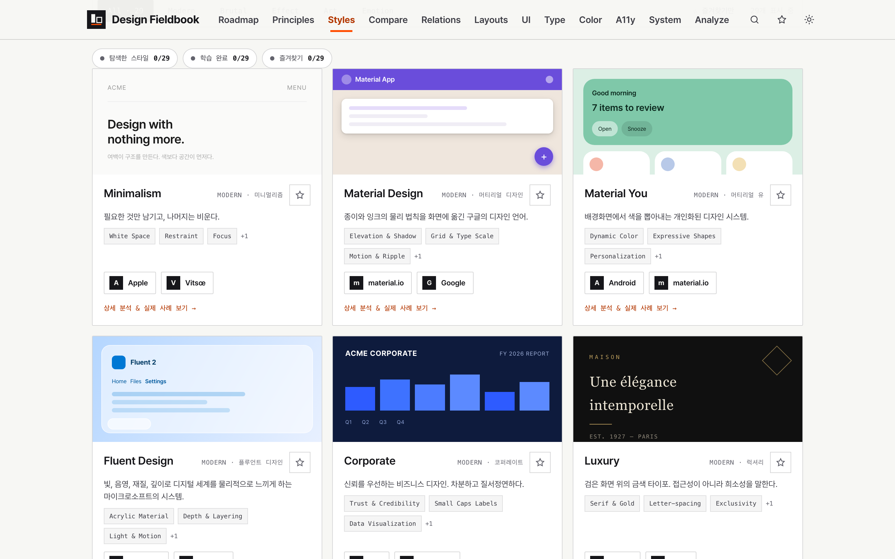
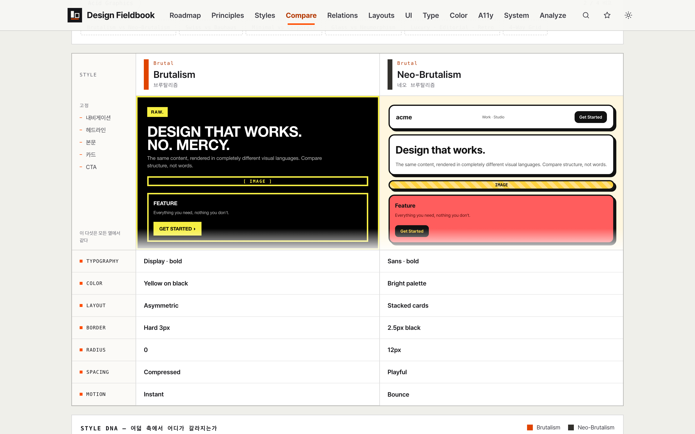
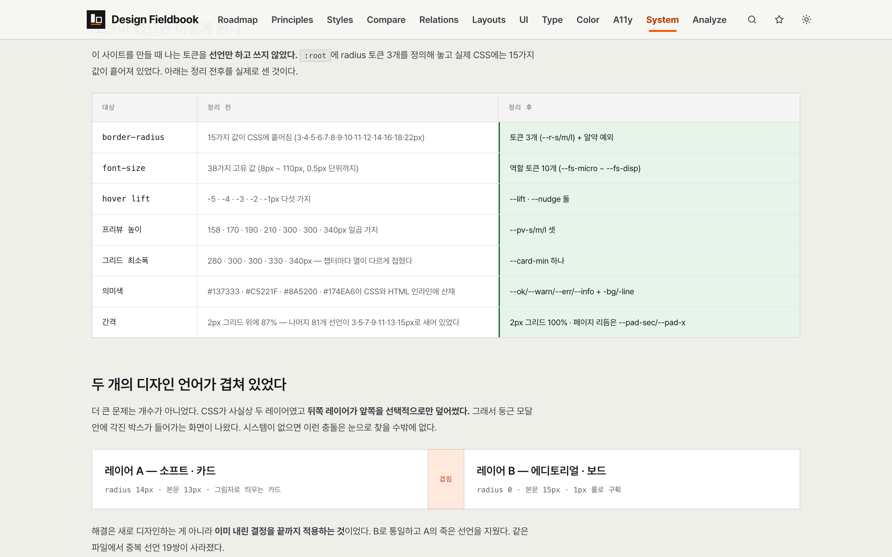
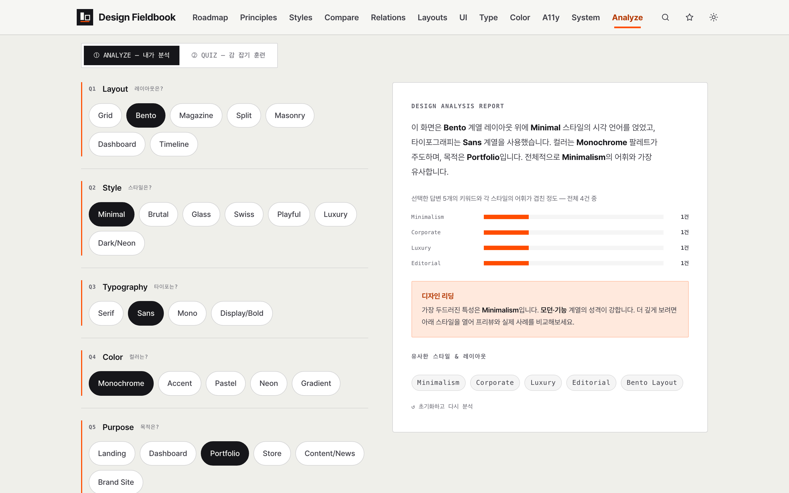
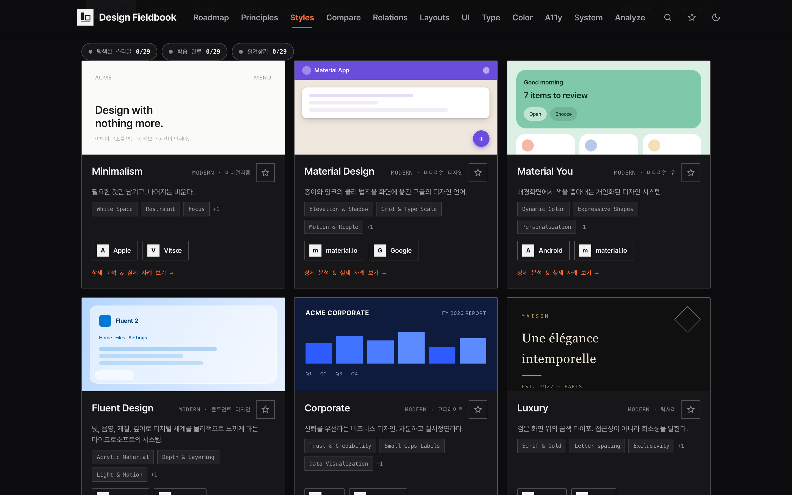

# Design Fieldbook — 인터랙티브 디자인 사전

AI가 특히 취약한 디자인 판단을 전적으로 위임했을 때 생기는 획일적인 결과와 **AI slop을 줄이기 위해**, 디자인 스타일·레이아웃·UI 패턴·타이포그래피를 직접 비교하고 검수할 기준을 만든 학습 사이트.
스타일 29개, 레이아웃 14개, UI 패턴 18개의 예시가 전부 살아 있는 DOM이다. 예시 스크린샷은 한 장도 쓰지 않았다.

**배포: https://design-study-three.vercel.app/**

| 홈 — 로드맵 | 디자인 원칙 | 게슈탈트 | 스타일 백과사전 |
| --- | --- | --- | --- |
|  |  |  |  |

| 스타일 비교 랩 | 스타일 관계 지도 | 디자인 시스템 | 디자인 분석기 |
| --- | --- | --- | --- |
|  |  |  |  |

> **관련 독립 프로젝트:** 이 웹사이트에서 축적한 지식을 AI 작업 절차와 검증 도구로 재구성한 [Design Fieldbook Skill](../Design_Fieldbook_Skill/)도 별도로 제작했다.

## 무엇을 만들었나

AI는 코드를 빠르게 만들 수 있지만, 디자인 도메인 지식과 평가 기준이 없는 상태에서는 익숙한 카드, 그라디언트, 과도한 라운드와 장식을 반복하기 쉽다. 무엇이 문제인지 설명하지 못하면 프롬프트를 여러 번 바꿔도 결과는 비슷한 **AI slop**으로 돌아온다.

그래서 AI에게 디자인을 더 잘해 달라고 요구하기 전에, 사람이 결과의 스타일·위계·가독성·일관성을 구분하고 지시할 수 있는 기준이 필요하다고 판단했다. 디자인 용어집은 많지만 대부분 글이다. "브루탈리즘은 거칠고 원초적인 스타일이다"를 백 번 읽어도 화면이 안 그려진다.

여기서는 **용어 옆에 그 용어대로 만든 화면**을 두고, Bad/Good 비교와 스타일 간 차이를 직접 조작하게 했다. 11개 챕터를 로드맵 순서대로 통과하며 디자인 도메인 지식을 익히고, 이후 AI가 만든 화면을 비판·수정할 수 있는 판단 체계를 만드는 구조다.

| 챕터 | 내용 |
| --- | --- |
| 01 디자인 원칙 | 원칙 13개를 Bad/Good 한 쌍으로. 같은 콘텐츠를 잘못 배치한 것과 제대로 배치한 것을 나란히 놓는다. 게슈탈트 지각 원리 7개는 인라인 SVG 도해 |
| 02 스타일 백과사전 | 스타일 29개 — 프리뷰·정의·특징·실제 사이트 사례·관찰 포인트. 즐겨찾기와 "학습 완료" 표시 |
| 03 스타일 비교 랩 | 최대 4개를 나란히. 같은 콘텐츠를 각 스타일의 렌더 레시피로 다시 그린다 |
| 04 스타일 관계 지도 | 역사적 영향 관계를 축으로 배치한 SVG 그래프. 노드를 누르면 그 스타일이 중심이 된다 |
| 05 레이아웃 백과사전 | 레이아웃 14종을 와이어프레임 ↔ 실사 두 모드로. 영역별 anatomy 설명 |
| 06 UI 패턴 라이브러리 | 내비게이션·콘텐츠·피드백·입력 4계열 18개 패턴. 동작하는 미니 컴포넌트 + 쓸 때/피할 때 |
| 07 타이포그래피 랩 | 용어를 슬라이더로 직접 조절, 같은 문장을 6가지 스타일로 비교, 폰트·크기·행간·자간·측정폭 플레이그라운드 |
| 08 컬러 시스템 | 배색 7종(모노크롬·유사색·보색·삼각·분할보색·듀오톤·그라디언트) |
| 09 접근성 | 대비·포커스·터치 타깃 등 6개 주제를 Bad/Good으로 |
| 10 디자인 시스템 | 토큰이 없을 때 벌어지는 일 — **이 사이트 자신을 감사한 결과**로 설명한다 |
| 11 디자인 분석기 | 질문 5개로 화면을 분해해 리포트 생성 + 스타일 맞히기 퀴즈 |

## 예시를 전부 라이브 DOM으로 만든 이유

스타일 프리뷰를 이미지로 넣는 게 훨씬 쉬웠다. 그렇게 하지 않은 이유는 세 가지다.

- **테마를 따라온다** — 다크 모드로 바꾸면 사이트 크롬이 뒤집히는데 예시만 밝은 채로 남는 일이 없다
- **확대해도 안 깨진다** — 타이포그래피 챕터에서 자간 0.1em 차이를 보여주려면 벡터여야 한다
- **토큰을 바꾸면 예시도 바뀐다** — 디자인 시스템 챕터가 주장하는 것을 사이트 자신이 지킨다

대가는 파일 크기다. 모든 예시 마크업이 데이터에 들어 있어서 `app.js`가 2,539줄이 됐다. 다만 이미지가 하나도 없으므로 실제 전송량은 이미지 몇 장보다 작고, 두 파일 모두 브라우저에 캐시된다.

```
외부에서 받아오는 리소스: 0건 (폰트 · 스크립트 · 이미지 · 아이콘 전부)
폰트: 시스템 스택 — Pretendard → -apple-system → Apple SD Gothic Neo
이미지 파일: 브랜드 마크 SVG 2개(라이트/다크)뿐
```

바깥으로 나가는 링크는 각 스타일의 실제 사례 사이트(Apple, Bauhaus Dessau, MoMA 등)뿐이고, 전부 사용자가 눌러야 열린다.

``로 들어가는 raster 이미지는 사이트 전체에 한 장도 없다. 모든 도해는 인라인 SVG이거나 CSS로 그린 실제 요소다.

## 스타일 비교 랩 — 같은 콘텐츠, 다른 레시피

스타일을 나란히 놓고 비교할 때 콘텐츠까지 다르면 무엇 때문에 달라 보이는지 알 수 없다.
그래서 **콘텐츠를 고정**했다. 브랜드명·헤드라인·본문·카드·CTA 다섯 요소는 모든 열에서 글자 한 자까지 같다.

```
CMP_CONTENT  고정 5요소 (내비게이션 · 헤드라인 · 본문 · 카드 · CTA)
     ↓
CMP_RECIPE[스타일]  스타일별 렌더 레시피 — 타이포·색·보더·radius·간격·모션
     ↓
같은 문장이 브루탈리즘에서는 노란 형광 위 검정 대문자로,
네오브루탈리즘에서는 12px radius의 두꺼운 검정 테두리 카드로 나온다
```

그 아래 **Style DNA**는 여덟 축(타이포그래피·여백·대비·보더 강도·둥글기·그림자·색 강도·장식)을 0–5로 매기고 축마다 Δ를 표시한다.
겉모습이 완전히 달라 보여도 Δ가 작은 축은 두 스타일이 공유하는 성질이라는 걸 보여주기 위한 장치다 — 예를 들어 브루탈리즘과 네오브루탈리즘은 그림자에서만 Δ5로 갈리고 나머지 일곱 축은 전부 Δ1~2다.

## 스타일 관계 지도

29개 스타일의 관계를 다섯 종류로 기록했다 — 영향을 준/받은(historical influence), 유사, 관련, 자주 혼동됨, 반대.

- **유사(Visual Similarity)는 손으로 적지 않는다.** Style DNA 8축을 벡터로 보고 유클리드 거리가 가장 가까운 스타일을 계산한다. 다른 관계로 이미 이어진 스타일은 제외해서 같은 선이 두 번 그려지지 않게 했다
- **원형 배치를 버렸다.** 링에 늘어놓으면 어떤 스타일을 골라도 똑같은 허브-앤-스포크 그림이 나오고, 챕터가 약속한 "역사적 흐름"이 화면에 없다. 지금은 조상이 왼쪽, 후손이 오른쪽, 방향 없는 관계는 아래 밴드로 간다
- **관계 종류는 노드 테두리가, 방향은 엣지가 말한다.** 액센트 화살표는 영향의 축에만 쓰고, 방향 없는 이웃은 공용 레일에 매단다
- **레이아웃 값은 전부 화면 내용에서 역산한다.** 고정 오프셋을 쓰면 조상 1개·후손 0개인 스타일(Luxury)에서 캔버스 1/3이 비고 밴드 마지막 줄이 viewBox 밖으로 잘렸다. 한쪽 축에 노드가 없으면 그 레일과 라벨은 아예 그리지 않는다

검증은 **중심 스타일 29개 × 필터 6개 = 174가지 조합**을 브라우저에서 전수로 돌려 viewBox 이탈·노드 겹침·라벨 잘림이 0인지 확인했다.

## 디자인 시스템 챕터 — 이 사이트를 감사한 결과

이 챕터만 남의 이야기가 아니다. 사이트를 만들면서 나온 토큰은 선언만 하고 쓰지 않았고, 실제 CSS에는 값이 흩어져 있었다.
정리 전후를 직접 센 결과를 그대로 챕터 본문에 넣었다.

| 대상 | 정리 전 | 정리 후 |
| --- | --- | --- |
| `border-radius` | 15가지 값이 CSS에 흩어짐 (3·4·5·6·7·8·9·10·11·12·14·16·18·22px) | 토큰 3개 (`--r-s/m/l`) + 알약 예외 |
| `font-size` | 38가지 고유 값 (8px ~ 110px, 0.5px 단위까지) | 역할 토큰 10개 (`--fs-micro` ~ `--fs-disp`) |
| hover lift | -5 · -4 · -3 · -2 · -1px 다섯 가지 | `--lift` · `--nudge` 둘 |
| 프리뷰 높이 | 158 · 170 · 190 · 210 · 300 · 300 · 340px 일곱 가지 | `--pv-s/m/l` 셋 |
| 그리드 최소폭 | 280 · 300 · 300 · 330 · 340px — 챕터마다 열이 다르게 접혔다 | `--card-min` 하나 |
| 의미색 | `#137333` `#C5221F` `#8A5200` `#174EA6`이 CSS와 HTML 인라인에 산재 | `--ok/--warn/--err/--info` + `-bg/-line` |
| 간격 | 2px 그리드 위에 87% — 나머지 81개 선언이 3·5·7·9·11·13·15px로 새어 있었다 | 2px 그리드 100% · 페이지 리듬은 `--pad-sec/--pad-x` |

더 큰 문제는 개수가 아니라 **CSS가 사실상 두 레이어였다는 것**이다. "소프트·카드"(radius 14px, 본문 13px, 그림자)와 "에디토리얼·보드"(radius 0, 본문 15px, 1px 룰)가 겹쳐 있어서 둥근 모달 안에 각진 박스가 들어가는 화면이 나왔다. 새로 디자인하는 대신 **이미 내린 결정을 끝까지 적용하는 쪽**으로 갔고, 같은 파일에서 중복 선언 19쌍이 사라졌다.

## 만들지 않은 것

포트폴리오용 사이트에서 제일 쉬운 유혹은 없는 숫자를 만들어 내는 것이다. 두 군데에서 그걸 걷어냈다.

- **분석기 리포트** — 예전에는 `Type 60 · Color 65 · Purpose 55`처럼 **입력과 무관한 고정값**을 막대그래프로 그렸다. 실제로 계산되는 유일한 값은 선택한 답변 5개의 키워드와 각 스타일 어휘가 겹친 건수다. 지금은 그 건수를 그대로 보여주고, 무엇을 센 수치인지도 캡션에 밝힌다. 겹치는 스타일이 하나도 없으면 *"그것도 결과입니다 — 29개 어디에도 딱 들어맞지 않는 조합이라는 뜻이니까요"*라고 말한다
- **로드맵 진행률** — 진행 링은 항목 단위 기록이 실제로 있는 두 단계(스타일·레이아웃)에만 그린다. 나머지 네 단계는 추적되는 게 챕터 방문 여부뿐이므로 그렇게만 말한다. 없는 퍼센트는 만들지 않는다

## 접근성

접근성 챕터를 쓰면서 사이트 자신에도 같은 기준을 적용했다.

- **대비** — 액센트(`#E04400`)를 9~13px 작은 글씨에 그대로 쓰면 4.5:1을 넘지 못한다(3.92:1). 같은 계열의 어두운 단계(`#B33700`, 5.65:1)를 **작은 텍스트 전용으로 분리**하고 밝은 단계는 큰 텍스트·테두리에만 쓴다
- **포커스** — 포커스 링은 액센트가 아니라 잉크 + 배경 헤일로다. 액센트는 이미 "선택됨"의 의미로 쓰이고 있어서 겹치면 안 된다
- **모달** — 열면 포커스를 안으로 옮기고 닫으면 열었던 자리로 돌려준다. 이게 없으면 키보드 사용자는 모달이 열린 줄도 모르고, 닫은 뒤 문서 맨 앞으로 튕긴다
- **스킵 링크** — 헤더에 챕터 탭이 12개다. 매번 12번 탭해서 본문에 닿을 수는 없어서 포커스를 받을 때만 나타나는 링크를 넣었다
- **토글 상태** — 토글 버튼이 상태를 색으로만 말하고 있었다. 접근성 트리에 아무 정보가 없어 `aria-pressed`를 붙였다(19곳)
- **검색** — 결과를 마우스로만 고를 수 있었다. 지금은 `combobox` + `aria-activedescendant`로 방향키 이동과 Enter 선택이 된다
- **모션** — `prefers-reduced-motion`을 존중한다. 히어로 자동 순환은 호버·포커스 중 멈추고, 사용자가 직접 스타일을 고르면 순환을 끝낸다

## 다크 모드

테마는 `<html data-theme>`으로 전환하고 `localStorage`에 남는다. 색은 라이트를 뒤집는 게 아니라 **모드별로 따로 계단을 만들었다.**
사이트 크롬은 뒤집히지만 **스타일 프리뷰는 자기 팔레트를 유지한다** — 미니멀리즘 예시가 다크 모드에서 검게 변하면 그건 더 이상 미니멀리즘 예시가 아니기 때문이다.



## 상태 저장

서버가 없다. 전부 `localStorage`이고 기기 밖으로 나가는 요청은 하나도 없다.

| 키 | 내용 |
| --- | --- |
| `dkm-theme` | 라이트/다크 선택 |
| `dkm-favs` | 즐겨찾기한 스타일 |
| `dkm-viewed` | 열어 본 스타일·레이아웃 |
| `dkm-learned` | "학습 완료" 표시 |
| `dkm-visited` | 방문한 챕터 — 로드맵 레일이 여기까지 주황으로 차오른다 |

## 라우팅

챕터마다 진짜 페이지다. 해시 라우팅이나 iframe을 쓰지 않는다 — 챕터별로 자기 `<title>`, description, `h1`, URL을 갖는다.

페이지에 없는 챕터의 훅은 당연히 없으므로, **문서 전역 조회는 실패 시 DOM에 붙지 않는 빈 요소를 돌려준다.** 그래야 이 페이지에 없는 챕터의 렌더러가 아무 데도 아닌 곳에 쓰고 조용히 끝난다 — 예외를 던져 나머지 스크립트를 죽이지 않는다.

챕터 사이의 의도는 함수 호출이 아니라 URL로 이동한다.

```
pages/styles.html?open=bauhaus     스타일 상세 모달을 연 채로 진입
pages/layouts.html?ly=bento        레이아웃 상세
pages/styles.html?cat=Brutal       카테고리 필터
pages/styles.html?q=거친            검색어 — 한국어 별칭 22개가 스타일 id로 매핑된다 ("거친" → brutal · neobrutal · construct)
index.html#styles, ?view=styles    예전 해시 주소 호환
```

## 실행

빌드가 없다. 클론해서 정적 서버로 열면 끝이다.

```bash
python3 -m http.server 8000
open http://localhost:8000
```

`index.html`을 파일로 직접 열어도 동작하지만, 챕터 간 상대 경로 때문에 서버로 여는 쪽을 권한다.

## 폴더 구조

```
index.html          홈 — 히어로 + 학습 로드맵
pages/              챕터 11개 + 예전 링크용 리다이렉트 1개
assets/app.js       데이터 + 렌더러 (2,539줄)
assets/app.css      토큰 + 컴포넌트 + 챕터 스타일 (1,706줄, 미디어쿼리 19개)
assets/*.svg        브랜드 마크 라이트/다크
docs/images/        README 스크린샷
```

`app.js`는 데이터와 렌더러가 반씩이다. 앞부분이 스타일·레이아웃·패턴·원칙 데이터이고, 뒷부분이 그 데이터를 화면에 붙이는 챕터별 렌더러다.

## 기술 스택

바닐라 HTML · CSS · JavaScript. 프레임워크·빌드 도구·패키지 매니저·런타임 의존성 전부 없음. 인라인 SVG · CSS 커스텀 프로퍼티 · localStorage · IntersectionObserver · Vercel 정적 호스팅.
