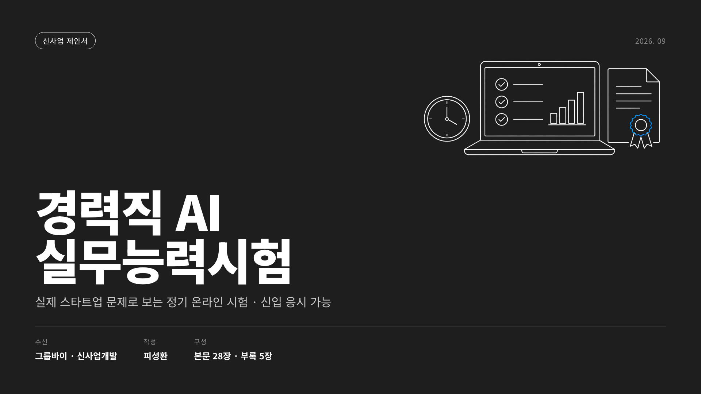

<h1 align="center">피성환</h1>

  <strong>AI-Native Product Builder · Product Strategy</strong> 
  새로운 도메인의 문제를 빠르게 학습하고, 
  AI를 활용해 조사·기획·구현·검증까지 끝까지 수행합니다.

  
  
  

  <a href="Groupby_BD/">Groupby BD</a> ·
  <a href="Chatbot/chat_bot_insaon/">인사ON</a> ·
  <a href="Jocoding_AX_Output/">AX Business Cases</a> ·
  <a href="Toss_MiniApp/Saju_Diary/">사주 다이어리</a> ·
  <a href="Design_Study/">Design Fieldbook</a> ·
  <a href="Design_Fieldbook_Skill/">Design Fieldbook Skill</a>

---

## 👋 About Me — AI-Native Product & Business Development

지방자치단체에서 약 5년 6개월간 사업기획, 예산·계약, 채용·급여, 공사·용역 감독과 유관기관 협의를 담당했습니다. 퇴직 후에는 이 경험에 AI를 결합해 새로운 도메인의 문제를 조사하고, 제품·사업안으로 구체화해 직접 검증하고 있습니다.

- **경력:** 2020. 10. 19. – 2026. 4. 1. 인천광역시 중구청 주무관
- **주요 결과:** 그룹바이 신사업 제안, Apps in Toss 미니앱 2건 출시, AX 인재전쟁 예선 상위 10%, 인사ON·PDF-to-Bot MCP 구축

---

## 🚀 Featured Work

### 01. 그룹바이 채용 플랫폼 신사업 — AI 실무능력시험

> **서류 밖의 실무 역량을 새로운 매칭 신호로 만들 수 있을까?** 
> 그룹바이 공개자료에서 출발해 문제의 크기, 제품 구조, 수익성, 영업 실행과 중단 기준까지 설계한 신사업 제안입니다.

  

표지를 누르면 33쪽 제안덱이 열립니다.

<table>
  <tr>
    <td align="center"><strong>약 72%</strong> 공고 1,000건 중 비개발 직군</td>
    <td align="center"><strong>510~725만원</strong> 기준 시나리오 회차 매출</td>
    <td align="center"><strong>20곳</strong> 공개 공고 600건 기반 BD 타겟</td>
  </tr>
</table>

문제는 비개발 직군의 실무 역량을 서류만으로 확인하기 어렵다는 점입니다. 이를 해결하기 위해 실제 스타트업 문제를 본인 장비·AI 도구·자료로 풀어보는 2시간 온라인 시험을 제안했습니다. 응시료가 아니라 성사 수수료와 우선 컨택권을 매출원으로 설정하고, 공고 분석·타겟 기업 20곳·세일즈 1페이저·콜드메일·가격표·파이프라인·2주 실행 캘린더까지 설계했습니다.

> **검증 경계:** 아직 실제 운영 성과는 없습니다. 자체 출제 문제의 실무 수준 → 응시·채용 활용 → 출제 기업 모집의 순서로 검증하며, 단계별 중단 기준까지 제안서에 명시했습니다.

  <strong><a href="Groupby_BD/AI실무능력시험_제안덱.pdf">AI 실무능력시험 제안덱 PDF 보기</a></strong>

---

### 02. 인사ON → PDF-to-Bot MCP — 사내 데이터 챗봇을 위한 선행 실험과 확장

> 기업들이 사내 규정과 업무 데이터를 활용한 챗봇을 만들려는 흐름에 주목했습니다. 다만 실제 사내 데이터는 기밀성과 접근 제약이 크기 때문에, 먼저 **공개된 공무원 인사 법령을 사내 규정의 대체 corpus로 사용해 구조를 선행 검증**했습니다.

  

  공개된 공무원 인사 법령을 바탕으로 휴직 기간·복직일·지급 반기를 함께 판단한 실행 화면

공개된 공무원 인사 법령으로 사내 규정 챗봇의 검색·근거·안전 구조를 검증했습니다. 처리 순서는 **질문 조건 추출 → 기준일·대상 필터 → lexical·vector 검색 → reranker → 인용·수량 근거 검증 → 답변 또는 재질문**입니다.

검증한 검색 계층은 PDF-to-Bot MCP로 확장해 다른 사내 문서에도 적용할 수 있도록 했습니다.

→ [인사ON 자세히 보기](Chatbot/chat_bot_insaon/) · [PDF-to-Bot MCP 확장 보기](Chatbot/pdf_chatbot_mcp/)

---

### 03. AX 인재전쟁 — 다양한 산업 문제를 AI로 해결해 예선 상위 10%

> 조코딩 AX 인재전쟁에 참가해 카카오페이증권·메디테라피·삼일PwC의 공개 문제를 각각 Codex 플러그인으로 해결했고, **예선 상위 10%**의 결과를 얻었습니다.

기업별 공개 문제를 정의하고 Codex 플러그인으로 해결해 **금융·뷰티·세무 3개 시스템을 제출했으며, 예선 상위 10%를 기록했습니다.**

하나의 아이디어를 기업명만 바꿔 제출하지 않았습니다. 세 기업의 경쟁 환경과 실제 업무를 따로 조사해 **금융·뷰티·세무에 서로 다른 문제와 시스템**을 만들었습니다.

카카오페이증권은 ETF 적립 백테스트, 메디테라피는 제품·콘텐츠 적합성 기반 시딩 랭킹, 삼일PwC는 세법 개정 영향 선제탐지 Tax Agent로 풀었습니다.

#### 📈 카카오페이증권 — 해외 ETF 모으기 백테스트

- **문제:** 초보 투자자가 해외 ETF를 얼마나·얼마나 오래 모았을 때 어떤 결과 범위가 있었는지 직관적으로 파악하기 어려움
- **구현:** `3·5·10년 × 매일 모으기 × 적립금액`을 조합하고, 모든 과거 일별 시작점의 최저·평균·최고 결과를 보여주는 모바일 웹 MVP
- **제품 판단:** 미래 수익을 예측하거나 ETF를 추천하지 않고, 표본이 없는 기간은 노출하지 않는 참고 도구로 제한
- **확장 범위:** 1년 및 매주·매월 모으기 비교

#### 💄 메디테라피 — 신제품과 인플루언서의 진정성 매칭

- **문제:** 단순 팔로워 순위로는 화장품 신제품과 자연스럽게 맞는 시딩 후보를 판단하기 어려움
- **구현:** 공개 정보를 수집해 건성·지성, 선호 제품 기능, 콘텐츠 주제와 표현 방식을 분류하는 랭킹 시스템
- **제품 판단:** 제품 적합성·기존 사용 맥락·협찬의 자연스러움·표현 리스크를 함께 평가해 진정성 있는 반응 가능성을 우선순위화

#### ⚖️ 삼일PwC — 세법 개정 영향 선제탐지

- **문제:** 세법 개정 시 기존 판례·국세청 FAQ·해석례·집행기준의 해석이 모호해지거나 변경될 수 있음
- **구현:** 개정 조문과 기존 자료를 연결해 변경 가능성이 있는 항목, 근거, 반대논거, 확인 질문을 만드는 Tax Agent
- **제품 판단:** 고객 문의 이후의 사후 검색이 아니라 **전문가 검토 → 고객 선제 안내**를 지원하며, AI가 세무 결론을 확정하지 않도록 제한

→ [세 프로젝트 비교해서 보기](Jocoding_AX_Output/) · [예선 상위 10% 결과](AI_Proficiency_Report/AX_인재전쟁_예선_상위10퍼센트.pdf)

#### APEX AI 역량분석 — 개발 직군 평가군에서 받은 Expert 결과

AX 인재전쟁과 같은 플랫폼에서 진행한 별도 AI 역량평가입니다. **개발 현업자·개발 전공 학생·개발 직군 구직자 등이 참여하는 평가에서, 개발 비전공자로서 동일한 과제를 수행해 Expert 결과를 받았습니다.**

**Expert · 87.5/100 · 2026년 8월 파일럿 61명 중 3위**

→ [APEX Expert AI 역량분석 리포트](AI_Proficiency_Report/APEX_Expert_AI_역량분석_리포트.pdf)

---

### 04. 미니프로젝트 — 사주 다이어리

> 운세·날씨·할 일·D-day·메모·일기를 확인할 때마다 서로 다른 앱을 찾아 켜야 하는 불편에서 출발했습니다. 각각의 사용 목적을 한 앱 안으로 흡수해, 사용자가 하루 중 여러 이유로 다시 찾는 제품을 만들었습니다.

  
  
  

홈 화면 · 오늘의 운세 상세 · 아침·낮·저녁·밤의 시간대별 기운

| | 내용 |
|---|---|
| 제품 아이디어 | 여러 앱을 찾아 켜야 하는 반복적 불편을 하나의 앱이 흡수해 사용 목적과 방문 빈도를 함께 확장 |
| AU 전략 | 운세로 첫 방문을 만들고, 날씨·할 일로 일상 효용을 넓히며, 메모·일기로 전환 비용과 재방문 이유를 축적 |
| 핵심 판단 | 생년월일과 일기는 민감정보이므로 서버를 만들지 않고 기기 로컬에 저장 |
| 제외한 기능 | 서버가 필요한 푸시 알림은 제외하고 일진 변화·기록·공유로 재방문 설계 |
| 구현 | 결정론적 사주 엔진, 공공 날씨 API, 일기·메모·D-day, 광고 폴백 |
| 검증 | Phase 0~14 개선 사이클, 30개 테스트 파일·604 tests |

**핵심:** 기능을 모아놓는 데서 끝내지 않고, 다른 앱으로 향하던 사용 목적을 제품 안으로 가져오는 방식으로 **AU(활성 사용자)와 반복 방문을 확보할 수 있는 구조**를 설계했습니다. 아직 실제 AU 성과를 주장하기보다, 출시 제품에서 이 가설을 검증할 수 있는 사용 루프를 구현한 단계입니다.

→ [프로젝트 자세히 보기](Toss_MiniApp/Saju_Diary/) · [실제 앱 — 모바일 환경 전용](https://minion.toss.im/jHGd3tmC)

> 실제 앱 링크는 모바일 환경에서만 정상적으로 이용할 수 있습니다.

---

### 05. Design Fieldbook — AI slop을 줄이는 디자인 판단 시스템

> AI는 화면을 빠르게 만들지만 디자인 도메인 지식과 평가 기준이 없으면 익숙한 카드·그라디언트·과도한 장식으로 수렴하는 **AI slop**을 만들기 쉽습니다. 프롬프트만 바꾸는 것으로는 한계가 있어, 결과를 구분하고 비판할 수 있는 디자인 지식부터 체계화했습니다.

  

- 디자인 스타일 29개, 레이아웃 14개, UI 패턴 18개
- 예시 이미지를 붙이지 않고 모두 실제 DOM과 CSS로 구현
- Bad/Good 비교와 스타일별 특징·적용 조건으로 AI 결과물을 평가할 기준 구축
- 접근성, 타이포그래피, 컬러, 디자인 시스템 감사 도구 포함
- 관계 지도 29개 스타일 × 필터 6개, 총 174개 조합 전수 검증

**접근 방식:** AI가 잘하지 못하는 디자인 판단을 그대로 위임하지 않고, 스타일·레이아웃·타이포그래피·접근성이라는 도메인 기준을 학습하고 결과를 검수할 수 있는 도구로 만들었습니다. 이 기준은 이후 AI로 제품 화면을 만들 때 획일적인 결과를 거르고, 의도에 맞는 디자인을 지시하는 기반이 됩니다.

→ [프로젝트 자세히 보기](Design_Study/) · [배포 사이트](https://design-study-three.vercel.app/)

---

### 06. Design Fieldbook Skill — 디자인 판단을 AI 작업 절차로 만든 스킬

> Design Fieldbook 웹사이트에서 학습하고 검증한 디자인 지식을, AI 에이전트가 실제 UI·랜딩 페이지 작업에서 반복 사용할 수 있는 **독립적인 실행 시스템**으로 다시 설계했습니다.

디자인 공부에서 끝내지 않고, 이미지 레퍼런스 → 구현 → 독립 디자인 검수 → Python 정적·렌더링 검증 순서를 스킬로 만들었습니다. 코드 규칙은 잘 지키지만 화면의 미적 응집력은 놓치는 AI의 한계를 줄이는 데 초점을 맞췄습니다. A/B/C 원샷 정성평가에서 C가 가장 높은 점수를 받았지만, 통계적 우위가 아닌 프로세스 가능성을 확인한 결과입니다.

→ [Design Fieldbook Skill 자세히 보기](Design_Fieldbook_Skill/) · [기반이 된 Design Fieldbook 웹사이트](Design_Study/)

## 🧩 More Work

| 프로젝트 | 내용 |
|---|---|
| 🎵 [오늘의 여름노래](Toss_MiniApp/Today_SummerSong/) | 200곡 큐레이션·추천·공식 링크 검증 파이프라인을 갖춘 Apps in Toss 앱 |

---

  <strong>Problem → Judgment → Build → Validate</strong>

## 연락처

- **Email**: [psungs1226@gmail.com](mailto:psungs1226@gmail.com)

## 기본 정보

- **학력**: 한국외국어대학교 전자물리학과 중퇴 (고졸)
- **병역**: 육군 병장 만기전역 (2018. 2. – 2019. 10.)
