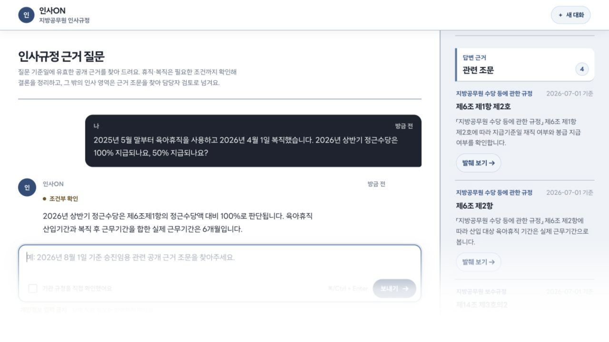
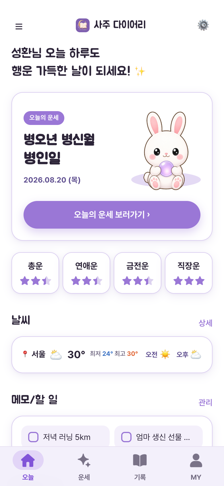
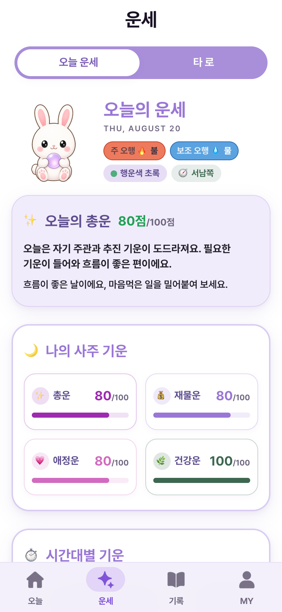
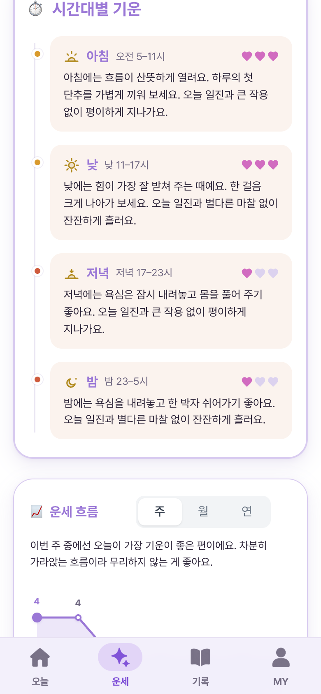

<h1 align="center">피성환</h1>

<p align="center">
  <strong>AI-Native Product Builder · Product Strategy</strong><br>
  새로운 도메인의 문제를 빠르게 학습하고,<br>
  AI를 활용해 조사·기획·구현·검증까지 끝까지 수행합니다.
</p>

<p align="center">
  
  
  
</p>

<p align="center">
  <a href="Chatbot/chat_bot_insaon/">인사ON</a> ·
  <a href="Jocoding_AX_Output/">AX Business Cases</a> ·
  <a href="Toss_MiniApp/Saju_Diary/">사주 다이어리</a> ·
  <a href="Design_Study/">Design Fieldbook</a> ·
  <a href="Design_Fieldbook_Skill/">Design Fieldbook Skill</a>
</p>

---

## 👋 About Me — AI-Native Builder

저는 AI를 특정 업무에 덧붙이는 도구가 아니라, **새로운 문제를 배우고 해결하는 기본 업무 방식**으로 사용합니다.

### 경력

- **2020. 10. 19. – 2026. 4. 1.**: 인천광역시 중구청 주무관
- **2017. 2. – 2017. 11.**: ㈜코반케미칼 사원

### 기본 정보

- **학력**: 한국외국어대학교 전자물리학과 중퇴 (고졸)
- **병역**: 육군 병장 만기전역 (2018. 2. – 2019. 10.)

지방자치단체 공무원으로 약 5년 6개월간 사업기획, 예산·계약, 채용·급여, 공사·용역 감독과 유관기관 협의를 담당했습니다. 이 과정에서 **복잡한 규정과 요구사항을 해석해 실행 가능한 업무로 구조화하는 능력**, 여러 이해관계자를 조율하는 능력, 판단의 근거를 문서로 남기고 결과에 책임지는 업무 태도를 갖추었습니다.

2026년 4월 퇴직한 뒤에는 기존 실무 역량에 AI 에이전트를 결합했습니다. 새로운 도메인의 자료를 빠르게 조사하고, 문제와 판단 기준을 정리해 제품·분석도구·자동화 시스템으로 구현하는 과정이 제 적성과 강점에 맞는다는 것을 발견했습니다.

AI와 개발 분야에서는 남들보다 늦게 출발했습니다. 대신 새로운 도구와 도메인을 빠르게 익히고, 배운 내용을 바로 작동하는 결과물로 만드는 방식으로 격차를 좁혀 왔습니다. 퇴직 이후 짧은 기간에 다음 결과를 만들었습니다.

- 조코딩 **AX 인재전쟁 예선 상위 10%**
- 개발 직군 대상 **APEX Expert AI 역량 결과**
- Apps in Toss 미니앱 2건 실제 출시
- 636개 테스트를 갖춘 인사ON과 PDF-to-Bot MCP 확장
- 금융·뷰티 마케팅·세무 문제를 다룬 기업별 Codex 플러그인 3건
- 디자인 지식과 검증 도구를 실행 절차로 만든 Design Fieldbook Skill

출발 시점보다 중요한 것은 **얼마나 빠르게 배우고, 실제 문제에 적용하고, 검증 가능한 결과로 전환하는가**라고 생각합니다. 공직에서 익힌 규정 해석, 책임 있는 판단, 문서화 습관에 AI-native 실행 방식을 결합해 빠르게 성장하고 있습니다.

도메인이 달라져도 문제를 해결하는 구조는 반복할 수 있다고 생각합니다. 처음 접하는 산업에서도 AI를 활용해 공개자료를 조사하고, 업무 흐름과 판단 기준을 구조화하고, 직접 제품·분석도구·자동화 시스템으로 구현한 뒤 테스트와 검증까지 수행합니다.

제가 생각하는 **AI-native 역량**은 단순히 프롬프트를 잘 쓰거나 결과물을 빠르게 만드는 것이 아닙니다.

```text
새로운 도메인 학습
   ↓ AI로 자료 조사·근거 분류
업무와 문제 구조화
   ↓ 사용자·리스크·의사결정 기준 정의
실행 가능한 형태로 구현
   ↓ 제품·프로토타입·에이전트·분석 파이프라인
결과 검증과 개선
   ↓ 테스트·평가·적대 검증·한계 공개
```

이 방식으로 서로 다른 도메인에서 실제 실행 결과를 만들었습니다.

| 도메인 | 해결한 문제 | 실행 결과 |
|---|---|---|
| 인사·규정 | 개정 시점과 조건에 따라 달라지는 규정 검토 | Temporal RAG 기반 인사ON + PDF-to-Bot MCP 확장 |
| 소비자 금융 | 주식 모으기 서비스의 직관성과 해외 ETF 적립 판단 | 기간·주기별 ETF 모으기 백테스트 + 모바일 웹 MVP |
| 글로벌 뷰티 마케팅 | 신제품과 진정성 있게 맞는 인플루언서 선정 | 제품 특성–피부 타입–콘텐츠 성향 기반 랭킹 시스템 |
| 세무 | 세법 개정 뒤 기존 판례·FAQ·해석례가 흔들릴 가능성 | 고객 전달 전 검토 대상을 찾는 선제탐지 Tax Agent |
| 소비자 앱 | 운세·날씨·할 일·기록마다 다른 앱을 찾아 켜야 하는 불편 | 여러 사용 목적을 한 제품으로 흡수해 AU·재방문을 만드는 Apps in Toss 앱 |
| 디자인 | AI가 도메인 판단 없이 만드는 획일적인 화면과 AI slop | 29개 스타일을 비교·분석하며 디자인 판단 기준을 만드는 Fieldbook |

특정 산업을 이미 안다고 가정하지 않습니다. **사실·가정·모르는 것을 분리하고, AI가 만든 결과를 다시 검증할 구조까지 설계하는 것**이 다양한 도메인에서 일할 수 있는 기반이라고 생각합니다.

## 🚀 Featured Work

### 01. 인사ON → PDF-to-Bot MCP — 사내 데이터 챗봇을 위한 선행 실험과 확장

> 기업들이 사내 규정과 업무 데이터를 활용한 챗봇을 만들려는 흐름에 주목했습니다. 다만 실제 사내 데이터는 기밀성과 접근 제약이 크기 때문에, 먼저 **공개된 공무원 인사 법령을 사내 규정의 대체 corpus로 사용해 구조를 선행 검증**했습니다.

<p align="center">
  
</p>
<p align="center">
  <sub>“2025년 5월 말부터 육아휴직을 사용하고 2026년 4월 1일 복직했습니다. 2026년 상반기 정근수당은 100% 지급되나요, 50% 지급되나요?” — 공개 재현용 corpus에서 휴직기간·복직일·지급 반기를 함께 판단해 “100%·실제 근무 6개월”과 제6조·제14조 근거를 반환한 실제 실행 화면</sub>
</p>

| | 내용 |
|---|---|
| 출발점 | 사내 데이터를 활용한 업무 챗봇의 검색·근거·안전 구조를 실제 내부자료 없이 먼저 검증 |
| 공개 데이터 선택 | 공무원 인사 법령은 개정 이력, 조건 분기, 예외, 수량 규정이 있어 사내 인사규정 챗봇의 난점을 재현 가능 |
| 해결해야 한 문제 | 개정 전후 조문 혼용, 필수 조건 누락, 근거 없는 수량 생성 |
| 핵심 판단 | 조건이 부족하면 재질문하고, 근거가 부족하면 답변을 중단 |
| 구현 | 조건 추출 → temporal filter → hybrid retrieval → reranker → citation validation |
| 검증 | 636 tests, B0→H3 ablation, distractor corpus, 합성 회귀셋 70건 |
| 한계 공개 | 법률 정답성·실사용자 효과 미측정, 로컬 추론 p50 62.9초 |

#### 🔌 다음 확장: PDF-to-Bot MCP

인사ON에서 검증한 구조 중 **PDF 추출·청킹·검색·출처 반환 계층을 범용화**해, 사용자가 PDF를 넣으면 Claude Code가 문서를 검색할 수 있는 MCP 초안을 만들었습니다.

```text
인사ON
공개 인사 법령으로 도메인 특화 RAG와 안전장치 검증
   ↓ 검색 계층 범용화
PDF-to-Bot MCP
임의의 PDF → 검색 인덱스 → search_documents → Claude가 근거 기반 답변
```

MCP는 별개의 토이 프로젝트가 아니라, 인사ON의 도메인 특화 구현을 **다른 사내 문서에도 적용 가능한 형태로 확장한 결과**입니다. Python MCP SDK 기반 stdio 서버로 구현했고 Claude Code 연결, 도구 노출, 실제 호출까지 MCP Inspector로 검증했습니다.

**핵심:** 사내 데이터 챗봇의 위험을 공개 데이터로 먼저 검증하고, 검증한 구성요소를 재사용 가능한 인터페이스로 확장했습니다.

→ [인사ON 자세히 보기](Chatbot/chat_bot_insaon/) · [PDF-to-Bot MCP 확장 보기](Chatbot/pdf_chatbot_mcp/)

---

### 02. AX 인재전쟁 — 다양한 산업 문제를 AI로 해결해 예선 상위 10%

> 조코딩 AX 인재전쟁에 참가해 카카오페이증권·메디테라피·삼일PwC의 공개 문제를 각각 Codex 플러그인으로 해결했고, **예선 상위 10%**의 결과를 얻었습니다.

#### 대회와 결과 한눈에 보기

| 참가 방식 | 제출 결과 | 평가 범위 |
|---|---:|---|
| 기업별 공개 문제를 정의하고 Codex 플러그인으로 해결 | **3개 기업·3개 시스템 / 예선 상위 10%** | 문제 발견·AI 협업 과정·산출물·검증 |

하나의 아이디어를 기업명만 바꿔 제출하지 않았습니다. 세 기업의 경쟁 환경과 실제 업무를 따로 조사해 **금융·뷰티·세무에 서로 다른 문제와 시스템**을 만들었습니다.

| 기업 | 발견한 문제 | 만든 시스템 |
|---|---|---|
| 📈 카카오페이증권 | 토스보다 직관성이 약한 해외 ETF 모으기 경험 | 적립 조건별 과거 결과를 비교하는 백테스트 MVP |
| 💄 메디테라피 | 팔로워 수만으로는 신제품과 진정성 있게 맞는 후보를 찾기 어려움 | 피부·제품 선호·콘텐츠 성향 기반 시딩 랭킹 |
| ⚖️ 삼일PwC | 세법 개정 뒤 기존 판례·FAQ·해석례의 의미가 달라질 수 있음 | 고객 안내 전 검토 대상을 찾는 선제탐지 Tax Agent |

#### 📈 카카오페이증권 — 해외 ETF 모으기 백테스트

- **문제:** 초보 투자자가 해외 ETF를 얼마나·얼마나 오래 모았을 때 어떤 결과 범위가 있었는지 직관적으로 파악하기 어려움
- **구현:** `3·5·10년 × 매일 모으기 × 적립금액`을 조합하고, 모든 과거 일별 시작점의 최저·평균·최고 결과를 보여주는 모바일 웹 MVP
- **제품 판단:** 미래 수익을 예측하거나 ETF를 추천하지 않고, 표본이 없는 기간은 노출하지 않는 참고 도구로 제한
- **확장 범위:** 1년 및 매주·매월 모으기 비교

#### 💄 메디테라피 — 신제품과 인플루언서의 진정성 매칭

- **문제:** 단순 팔로워 순위로는 화장품 신제품과 자연스럽게 맞는 시딩 후보를 판단하기 어려움
- **구현:** 공개 정보를 수집해 건성·지성, 선호 제품 기능, 콘텐츠 주제와 표현 방식을 분류하는 랭킹 시스템
- **제품 판단:** 제품 적합성·기존 사용 맥락·협찬의 자연스러움·표현 리스크를 함께 평가해 진정성 있는 반응 가능성을 우선순위화

#### ⚖️ 삼일PwC — 세법 개정 영향 선제탐지

- **문제:** 세법 개정 시 기존 판례·국세청 FAQ·해석례·집행기준의 해석이 모호해지거나 변경될 수 있음
- **구현:** 개정 조문과 기존 자료를 연결해 변경 가능성이 있는 항목, 근거, 반대논거, 확인 질문을 만드는 Tax Agent
- **제품 판단:** 고객 문의 이후의 사후 검색이 아니라 **전문가 검토 → 고객 선제 안내**를 지원하며, AI가 세무 결론을 확정하지 않도록 제한

세 프로젝트가 공유하는 원칙은 하나입니다. **AI가 모르는 것을 단정하지 않습니다.** 정보가 부족하면 `확인 필요`, 데이터가 부족하면 `needs_more_data`, 전문가 검토가 필요하면 `REVIEW_WORTHY`로 넘깁니다.

**접근 방식:** 산업 지식을 단정하지 않고, 공개 근거와 업무 흐름을 구조화해 사람이 더 나은 결정을 내릴 수 있도록 설계했습니다.

→ [세 프로젝트 비교해서 보기](Jocoding_AX_Output/) · [예선 상위 10% 결과](AI_Proficiency_Report/AX_인재전쟁_예선_상위10퍼센트.pdf)

#### APEX AI 역량분석 — 개발 직군 평가군에서 받은 Expert 결과

AX 인재전쟁과 같은 플랫폼에서 진행한 별도 AI 역량평가입니다. **개발 현업자·개발 전공 학생·개발 직군 구직자 등이 참여하는 평가에서, 개발 비전공자로서 동일한 과제를 수행해 Expert 결과를 받았습니다.**

| 구분 | 내용 |
|---|---|
| **평가 대상** | 개발 현업자·학생·구직자 등 개발 관련 직군 중심 |
| **이론 평가** | Claude의 기능과 활용 방식에 대한 이해도 테스트 |
| **실기 평가** | PRD를 바탕으로 Codex를 활용해 오픈소스 Hono 프로젝트를 분석·개선 |
| **평가 방식** | 최종 결과물뿐 아니라 프롬프트 사용 내역과 문제 해결 과정까지 함께 평가 |
| **결과와 의미** | **Expert** — 비전공자도 AI 에이전트를 활용해 개발 과제를 이해하고 구현·개선할 수 있음을 외부평가로 확인 |

→ [APEX Expert AI 역량분석 리포트](AI_Proficiency_Report/APEX_Expert_AI_역량분석_리포트.pdf)

---

### 03. 사주 다이어리 — 여러 앱의 사용 목적을 흡수하는 데일리 앱

> 운세·날씨·할 일·D-day·메모·일기를 확인할 때마다 서로 다른 앱을 찾아 켜야 하는 불편에서 출발했습니다. 각각의 사용 목적을 한 앱 안으로 흡수해, 사용자가 하루 중 여러 이유로 다시 찾는 제품을 만들었습니다.

<p align="center">
  
  
  
</p>

<p align="center"><sub>홈 화면 · 오늘의 운세 상세 · 아침·낮·저녁·밤의 시간대별 기운</sub></p>

| | 내용 |
|---|---|
| 제품 아이디어 | 여러 앱을 찾아 켜야 하는 반복적 불편을 하나의 앱이 흡수해 사용 목적과 방문 빈도를 함께 확장 |
| AU 전략 | 운세로 첫 방문을 만들고, 날씨·할 일로 일상 효용을 넓히며, 메모·일기로 전환 비용과 재방문 이유를 축적 |
| 핵심 판단 | 생년월일과 일기는 민감정보이므로 서버를 만들지 않고 기기 로컬에 저장 |
| 제외한 기능 | 서버가 필요한 푸시 알림은 제외하고 일진 변화·기록·공유로 재방문 설계 |
| 구현 | 결정론적 사주 엔진, 공공 날씨 API, 일기·메모·D-day, 광고 폴백 |
| 검증 | Phase 0~14 개선 사이클, 30개 테스트 파일·604 tests |

**핵심:** 기능을 모아놓는 데서 끝내지 않고, 다른 앱으로 향하던 사용 목적을 제품 안으로 가져오는 방식으로 **AU(활성 사용자)와 반복 방문을 확보할 수 있는 구조**를 설계했습니다. 아직 실제 AU 성과를 주장하기보다, 출시 제품에서 이 가설을 검증할 수 있는 사용 루프를 구현한 단계입니다.

→ [프로젝트 자세히 보기](Toss_MiniApp/Saju_Diary/) · [실제 앱 — 모바일 환경 전용](https://minion.toss.im/jHGd3tmC)

> 실제 앱 링크는 모바일 환경에서만 정상적으로 이용할 수 있습니다.

---

### 04. Design Fieldbook — AI slop을 줄이는 디자인 판단 시스템

> AI는 화면을 빠르게 만들지만 디자인 도메인 지식과 평가 기준이 없으면 익숙한 카드·그라디언트·과도한 장식으로 수렴하는 **AI slop**을 만들기 쉽습니다. 프롬프트만 바꾸는 것으로는 한계가 있어, 결과를 구분하고 비판할 수 있는 디자인 지식부터 체계화했습니다.

<p align="center">
  
</p>

- 디자인 스타일 29개, 레이아웃 14개, UI 패턴 18개
- 예시 이미지를 붙이지 않고 모두 실제 DOM과 CSS로 구현
- Bad/Good 비교와 스타일별 특징·적용 조건으로 AI 결과물을 평가할 기준 구축
- 접근성, 타이포그래피, 컬러, 디자인 시스템 감사 도구 포함
- 관계 지도 29개 스타일 × 필터 6개, 총 174개 조합 전수 검증

**접근 방식:** AI가 잘하지 못하는 디자인 판단을 그대로 위임하지 않고, 스타일·레이아웃·타이포그래피·접근성이라는 도메인 기준을 학습하고 결과를 검수할 수 있는 도구로 만들었습니다. 이 기준은 이후 AI로 제품 화면을 만들 때 획일적인 결과를 거르고, 의도에 맞는 디자인을 지시하는 기반이 됩니다.

→ [프로젝트 자세히 보기](Design_Study/) · [배포 사이트](https://design-study-three.vercel.app/)

---

### 05. Design Fieldbook Skill — 디자인 판단을 AI 작업 절차로 만든 스킬

> Design Fieldbook 웹사이트에서 학습하고 검증한 디자인 지식을, AI 에이전트가 실제 UI·랜딩 페이지 작업에서 반복 사용할 수 있는 **독립적인 실행 시스템**으로 다시 설계했습니다.

디자인 공부에서 끝내지 않고 AI에게 실제 화면을 반복해서 만들게 하며 **무엇을 잘 지키고, 무엇을 계속 놓치는지 직접 테스트**했습니다. AI는 크기·간격·대비처럼 코드로 명시할 수 있는 규칙은 비교적 잘 따랐지만, 실제 렌더링 결과와 미적 응집력은 코드만으로 보장하지 못했습니다.

그래서 반복되는 실패를 계속 규칙으로 깎아냈습니다. 화면에서만 드러나는 문제는 렌더링 검사를 강제하고, 제작 에이전트의 자기 검수는 선택을 정당화하는 편향이 생길 수 있어 fresh context의 디자인 검수용 서브에이전트로 분리했습니다.

사주 다이어리 디자인 과정에서 **이미지를 레퍼런스로 제공했을 때 AI가 텍스트 지시만 받을 때보다 톤과 구도를 안정적으로 따라가는 경험**을 했습니다. 이를 핵심 개선 아이디어로 발전시켜, 코딩 전에 동일 콘텐츠의 전체 페이지 이미지 시안 3종을 만들고 비교한 뒤 선택한 시안의 톤앤매너·레이아웃 관계를 구현에 주입하는 단계를 추가했습니다.

```text
방향 판단 → 이미지 시안 3종 비교·선택 → 토큰 계산 → UI 구현
                                                ↓
           디자인 검수용 서브에이전트
             ├─ 결함 발견 → 수정 ─┐
             └─ 통과              │
                                  ↓
           Python 정적·렌더링 게이트│
             ├─ FAIL·재발 → 수정 ─┘
             └─ 0 FAIL → 완료
```

#### 동일 프롬프트 A/B/C 원샷 비교

동일한 자기소개 콘텐츠·입력 이미지·프롬프트·모델·effort를 사용하고 적용 스킬만 바꿨습니다. **A는 스킬 미사용, B는 GitHub [`taste-skill`](https://github.com/leonxlnx/taste-skill), C는 Design Fieldbook Skill**입니다. B의 비교 대상은 **80.1k stars · 5.5k forks**를 기록한 공개 디자인 스킬 저장소입니다(2026-08-25 확인).

스킬 제작·개선과 A/B/C 생성은 Claude Code에서 진행하고, 완성된 결과는 **GPT-5.6 High와 Gemini 3.1 Pro**에 각각 제공해 별도로 검수했습니다.

| 검수 모델 | A — 스킬 미사용 | B — taste-skill | C — Design Fieldbook | 종합 순위 |
|---|---:|---:|---:|---|
| GPT-5.6 · High | 81/100 | 88/100 | **93/100** | **C > B > A** |
| Gemini 3.1 Pro | 8.5/10 | 9.5/10 | **9.8/10** | **C > B > A** |

두 모델 모두 C를 가장 높게 평가했습니다. 단, GPT-5.6의 정보 위계·가독성은 B가 C보다 1점 높았습니다.

##### A — 스킬 미사용

<p align="center">
  
</p>

익숙한 밝은 포트폴리오 랜딩 구조입니다.

##### B — GitHub [taste-skill](https://github.com/leonxlnx/taste-skill)

<p align="center">
  
</p>

넓은 여백과 절제된 타이포그래피를 사용한 에디토리얼 구성입니다.

##### C — Design Fieldbook Skill

<p align="center">
  
</p>

대형 한글 헤드라인·고대비 다크 표면·성과 지표의 차등으로 메시지와 증거의 위계를 강화했습니다.

단일 원샷 정성평가이므로 일반적인 우위를 주장하지 않고, 이미지 레퍼런스를 코드와 검증 루프에 연결하는 방식의 가능성을 확인한 결과로 한정합니다.

→ [A/B/C 원본 HTML과 실험 조건](Design_Fieldbook_Skill/experiments/abc-test/) · [GPT·Gemini 검수 원본](Design_Fieldbook_Skill/#검수-원본)

- **검수 분리:** 화면을 만든 에이전트가 스스로 통과시키지 못하도록 fresh context의 디자인 검수용 서브에이전트를 필수 단계로 지정
- **규칙 강제:** `tokens.py`·`verify.py`·`render_audit.py`·`gate.py`가 토큰 생성부터 실제 화면 검증까지 강제하며, 검수 기록이 없거나 HTML 해시가 다르면 다음 단계 중단
- **상태형 수렴 루프:** `.gate-history.json`에 회차를 저장하고 결함을 신규·잔존·해결·재발로 추적합니다. 미적 결함이나 코드 FAIL이 하나라도 남으면 구현 단계로 돌아가며, 반복되는 문제는 규칙·토큰·레이아웃 설계 변경으로 전환

`SKILL.md`와 참고자료·검증 스크립트·장르별 프로브를 포함한 **27개 파일, 약 7,120줄**로 구성했습니다.

**한계:** 이미지 시안 단계에는 이미지 생성이 가능한 Codex 환경 또는 별도의 이미지 생성 API가 필요합니다. 시안 생성·검수·수정 루프를 거치므로 단순 생성보다 시간과 비용이 더 들며, A/B/C 결과도 단일 원샷 사례라 통계적 우위를 의미하지 않습니다. GPT·Gemini 평가는 사람 대상 사용성 조사나 공식 벤치마크가 아닌 이종 모델의 정성 검수입니다.

**현재 상태:** 첫 버전을 공개했으며, 실제 사용에서 확인되는 실패 사례를 바탕으로 규칙과 검증 범위를 추가 보강할 예정입니다.

→ [Design Fieldbook Skill 자세히 보기](Design_Fieldbook_Skill/) · [기반이 된 Design Fieldbook 웹사이트](Design_Study/)

## 🧩 More Work

| 프로젝트 | 내용 |
|---|---|
| 🎵 [오늘의 여름노래](Toss_MiniApp/Today_SummerSong/) | 200곡 큐레이션·추천·공식 링크 검증 파이프라인을 갖춘 Apps in Toss 앱 |

---

<p align="center">
  <strong>Problem → Judgment → Build → Validate</strong>
</p>
