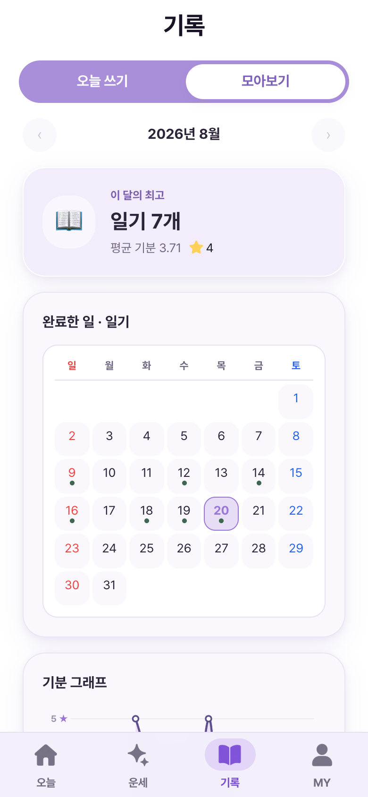
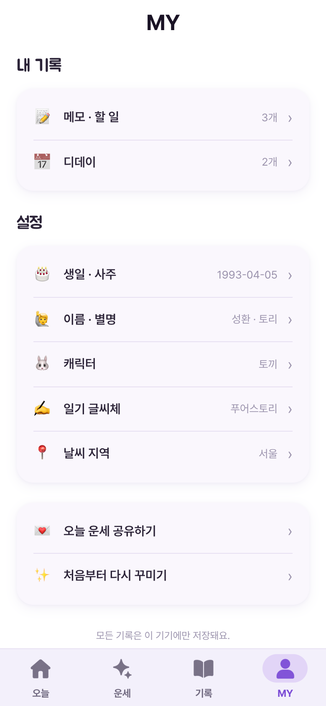

# 사주 다이어리 — 앱인토스 미니앱

운세·날씨·할 일·D-day·메모·일기를 위해 **여러 앱을 찾아 켜야 하는 불편을 한 제품으로 흡수해, AU와 반복 방문을 넓히도록 설계한** 토스 미니앱.
앱인토스 바이브코딩 챌린지 출품작이며 토스 앱에서 실제로 동작한다.

**실제 앱(모바일 환경 전용): https://minion.toss.im/jHGd3tmC**

> 실제 앱 링크는 모바일 환경에서만 정상적으로 이용할 수 있습니다.

| 홈 — 오늘 | 오늘의 운세 | 시간대별 기운 | 타로 |
| --- | --- | --- | --- |
|  |  |  |  |

| 일기 | 돌아보기 | MY |
| --- | --- | --- |
|  |  |  |

> 캡쳐는 로컬 개발 서버에서 데모 데이터(생일·메모·일기·날씨)를 넣고 찍었다. 실제 앱은 사용자가 입력한 값과 기상청 실데이터로 동작한다.

## 무엇을 만들었나

### 여러 앱으로 향하던 사용 목적을 하나의 제품으로

하루를 시작할 때 운세 앱을 열고, 날씨 앱으로 옮겨가고, 할 일과 D-day는 일정 앱에서 확인하고, 떠오른 생각은 메모 앱에 적고, 하루가 끝나면 다시 일기 앱을 여는 흐름에 주목했다. 각각은 자주 하는 행동이지만 서로 다른 앱에 흩어져 있어 매번 화면과 맥락을 바꿔야 한다.

사주 다이어리는 이 행동들을 단순히 한 화면에 모으는 데서 끝내지 않는다. 각각 다른 앱으로 향하던 **사용 목적과 방문 순간을 한 제품이 흡수**하고, ‘오늘’이라는 맥락으로 연결한다.

```text
운세로 오늘을 시작
   ↓
날씨·할 일·D-day로 하루를 준비
   ↓
메모로 순간을 남김
   ↓
완료한 일·날씨·기분과 함께 일기로 마무리
   ↓
돌아보기에서 하루와 한 달의 흐름을 확인
```

운세는 매일 앱을 열게 하는 **첫 방문 동기**, 날씨·할 일·D-day는 하루 중 사용 이유를 늘리는 **반복 효용**, 메모·일기는 기록이 쌓일수록 제품에 남을 이유가 커지는 **축적 자산** 역할을 한다. 기능을 나열한 허브가 아니라 다른 앱으로 빠져나가던 행동을 흡수해, 한 사용자가 더 자주 돌아오도록 설계한 것이다.

따라서 제품 가설은 명확하다. **여러 개의 작은 고빈도 사용 목적을 하나의 자연스러운 루프로 연결하면 AU(활성 사용자)와 재방문을 함께 키울 수 있다.** 현재는 실제 출시와 사용 루프 구현까지 마쳤으며, 실사용 AU 개선 수치는 아직 별도로 검증하지 않았다는 한계도 함께 둔다.

- **오늘의 운세** — 생년월일로 사주 원국을 뽑고, 오늘 일진과 대조해 총운·재물운·애정운·건강운을 매일 새로 계산
- **시간대별 기운** — 하루를 아침/낮/저녁/밤 4블록으로 나눠 각각 좋은 때·조심할 때를 표시. 오늘 일진에 따라 매일 뒤집힌다
- **운세 흐름** — 주·월·연 단위로 운세 점수 추이를 그려 "오늘이 이번 주 중 어디쯤인지" 보여줌
- **타로** — 메이저 아르카나 22장, 하루 한 장. 뽑으면 그날은 같은 카드로 잠긴다
- **날씨** — MY에서 고른 도시(최대 2곳)의 기상청 단기예보 + 미세먼지 + 자외선
- **일기** — 그날 운세·날씨·완료한 할 일이 헤더에 자동으로 박제된다. 손글씨 폰트 5종, 사진 1장 첨부
- **돌아보기** — 월간 기분 그래프, 기록 캘린더, 일기 모아보기
- **캐릭터** — 토끼/고양이/강아지/수달 중 선택, 이름을 지어 주면 홈에서 불러 준다

푸시 알림은 쓰지 않았다. 클라이언트 로컬 알림이 불가하고 실발송은 서버가 필요하다 — 재방문은 **일진이 매일 바뀌는 것 자체**와 공유로 유도했다.

## 사주 엔진

`src/features/fortune/`. 서버·LLM 없이 클라이언트에서 결정론적으로 계산한다. 같은 (생일, 날짜)면 항상 같은 결과가 나온다.

정적 운세표를 쓰면 매일 안 바뀌고 누구에게나 똑같아진다. 그래서 **실제 만세력으로 내 일간 × 오늘 일진을 계산**하는 쪽을 택했다.

```
생년월일 → 사주 원국(년·월·일·시주 간지, 일간, 십신)      ← lunar-javascript, 온보딩 1회 캐시
오늘 날짜 → 일진 간지 + 재신/희신 방위                    ← 매일 갱신
     ↓
오행 세력 합산 → 신강/신약 판정 → 희신/기신 확정
     ↓
오늘 일진이 나에게 喜/忌/中 인가 → 별점 → 문구 조립
```

- **가중치**: 월지 ×3 · 일지 ×2 · 년지·시지 ×1.5 · 천간 ×1.0. 扶(비겁+인성) / 抑(식상+재성+관성) 비율로 신강·신약을 가른다
- **개인화의 핵심**: 신강인 사람과 신약인 사람은 **같은 날짜에 반대 점수**가 나온다. 신강이면 식상·재성·관성이 희신, 신약이면 비겁·인성이 희신이다
- **시간대별 기운**은 四正 왕지(卯木·午火·酉金·子水)에 체질 희기를 얹고, 오늘 일진 지지와의 六合(+1)/六沖(−1)으로 보정한다 — 그래서 매일 흐름이 달라진다
- **행운색**도 개인화된다. 신약·중화면 일간을 生하는 오행, 신강이면 일간이 剋하는 오행에서 색을 뽑는다
- **문구**는 `(관계 × 오행 × 항목)` 상태키마다 4~6개를 두고 `seed(생년월일 + 오늘날짜)` 해시로 고른다. 같은 날엔 고정, 날마다 신선. 총 651개 문구 전부 정적 JSON
- 결과에는 근거(`basis`)를 함께 실어 "신약 사주라 오늘 인성이 희신" 같은 설명이 가능하게 했다

### 유파 정합 — "우리만 사주가 다르다"를 막는 장치

운세 앱은 다른 만세력과 결과가 어긋나는 순간 신뢰가 끝난다. 그래서 갈리는 지점을 전부 **주류 디폴트**로 고정하고 테스트로 박았다.

| 항목 | 처리 |
| --- | --- |
| 입춘 년주 · 절기 월주 · 60갑자 일주 · 음력/윤달 | `lunar-javascript`(MIT)에 위임 — 유파 무관, 직접 재구현 안 함 |
| 야자시(23시 출생) | 晩子時(sect 2) = 당일 일주 유지, 주류 디폴트 |
| 진태양시 경도보정 | OFF(표준시 KST 그대로) — 소비자 만세력 다수파 |
| 결과가 내가 아는 사주와 다를 때 | MY에서 네 기둥을 직접 입력해 원국을 덮어쓸 수 있게 함 |

`calibration.fixture.ts` / `calibration.test.ts`에 입춘 전후·절기 경계·23시 출생·윤달·윤년 케이스를 golden 값으로 고정했다. 설정이 바뀌어 정합이 깨지면 테스트가 즉시 잡는다.

## 데이터를 어디서 가져왔나

챌린지 규정상 제3자 IP·크롤링 데이터를 쓸 수 없었다. 세 갈래로만 조달했다.

| 종류 | 출처 | 비고 |
| --- | --- | --- |
| 사주·운세 | 자체 계산 | `lunar-javascript`(6tail, MIT)로 만세력, 해석은 자체 엔진 |
| 운세 문구 651개 · 타로 22장 | 직접 작성 | `data/fortune-phrases.json`, `data/tarot.json` |
| 날씨 | 공공 API(읽기 전용) | 기상청 단기예보 + 에어코리아 미세먼지 + 생활기상지수 자외선 |
| 캐릭터 · 타로 일러스트 · 탭 아이콘 | 생성 이미지 | `public/mascots`, `public/tarot`, `public/tabicons` |
| 일기·메모·D-day·생일 | 사용자 입력 | 전부 기기 로컬 |

크롤링·라이선스 데이터는 한 건도 쓰지 않았다.

## 로컬 전용 저장

생년월일과 일기는 민감 정보라 **서버를 아예 만들지 않았다.**

- 모든 사용자 데이터는 앱인토스 `Storage`(기기 로컬)에만 저장. 키 네임스페이스는 `evrytimes:*`
- 저장 계층은 `src/features/storage/` 한 곳을 통과한다. 스키마 버전 봉투 + 마이그레이션 훅 자리를 마련해 뒀다
- 토스 앱 밖(브라우저 미리보기 등)에서는 네이티브 브리지가 없어 저장이 깨진다 → **첫 op에서 1회 프로브** 후 `localStorage` → 인메모리로 자동 폴백한다. 모든 폴백 경로도 기기 안에만 존재한다
- 외부로 나가는 요청은 날씨 공공 API **읽기**뿐이다. 인증키는 소스에 넣지 않고 `VITE_DATA_GO_KR_KEY`로 주입한다
- 일기 이미지 저장도 외부 라이브러리 없이 **Canvas2D로 직접 그려서** 기기에 저장한다(`diary-image.ts`)
- 트레이드오프는 앱을 지우면 기록이 사라진다는 것. 온보딩과 MY 하단에 이 사실을 상시 고지했다

## 컨테스트 규정 대응

- **심사 기간(~7/26) 수익화 0** — 결제·광고는 AU를 깎는 마찰이라 컨테스트 빌드에서 전부 뺐다. 타입에 `Tier = 'free' | 'premium'` 플래그만 두고 토글은 꺼 둔 상태. 단순 리워드성 앱 규정을 피하려고 출석 리워드도 넣지 않았다(연속 출석은 표시만)
- **결제는 지금도 0** — IAP·구독 SDK는 쓰지 않는다
- **광고는 AU 기간 종료 후 추가** — `src/features/ads/`에 전면(인터스티셜) 광고 게이트를 붙였다. 운세 보기 / 일기 이미지 저장 / 날씨 상세 3곳에서만 뜨고, **광고가 기능을 인질로 잡지 않게** 설계했다: 90초 빈도캡, 8초 안전 타임아웃, 미지원 런타임·광고 ID 미주입·로드 실패 어느 경우에도 원래 동작은 **정확히 한 번** 실행된다. 광고 그룹 ID는 `VITE_AIT_AD_GROUP_ID`로 주입하고, 없으면 광고는 자동 비활성
- **푸시 미사용** — 동의 API조차 호출하지 않는다
- **스택 고정** — `@apps-in-toss/web-framework` + React DOM + TDS. React Native 프리미티브·상태관리 라이브러리 추가 없음
- **권한** — `granite.config.ts`에 위치 권한만 선언(기상청 격자 변환용). 출시 빌드는 결국 프리셋 도시 선택 방식으로 갔고, 위경도→격자 변환 함수(`weather/grid.ts`)는 그대로 쓰인다

## 개발 방식 — Phase 하네스

작업을 `phases/{phase}/step{N}.md` 단위로 쪼개고 `python3 scripts/execute.py {phase}`로 실행했다. 각 step은 자기 파일에 적힌 "읽어야 할 파일" 목록만 읽는다 — 컨텍스트 예산을 step당 300K 토큰 이내로 묶기 위해서다.

Phase 0~14까지 15개 단계를 돌렸다.

```
0 기반   1 운세   2 날씨   3 기록   4 공유   5 빌드·제출
6 일기·메모·사주   7 운세 심화   8 운세 전문화   9 온보딩 폴리시
10 홈 UX   11 기록 UI   12 피드백 반영   13 운세 가독성   14 온기 기능
```

Phase 5까지가 6/30 콘솔 제출분이고, 6~14는 AU 측정 기간 중 사용자 피드백을 받아 돌린 개선 사이클이다. 반복해서 나온 지적("시인성이 나쁘다 / 색이 옅다 / 여백이 크다")은 `CLAUDE.md`에 규칙으로 박아 다음 phase부터 자동으로 지켜지게 했다.

순수 로직 모듈은 전부 단위 테스트를 동반한다 — 만세력·부억 판정·격자 변환·공유 텍스트 빌더·D-day 계산·기분 그래프 등 **30개 파일 604개 테스트**.

## 실행

```bash
npm install
npm run dev          # granite dev — QR로 토스 앱에서 확인
npm test             # vitest — 604개
npm run build        # .ait 번들 생성
npm run deploy       # 앱인토스 콘솔 배포
```

날씨 공공 API 인증키는 환경 변수로 주입한다. 키가 없어도 빌드·테스트는 통과하고, 앱은 날씨만 폴백 표시한 채 정상 동작한다(운세·일기·메모·D-day는 네트워크가 필요 없다).

```bash
VITE_DATA_GO_KR_KEY=...      # 날씨 공공 API 인증키
VITE_AIT_AD_GROUP_ID=...     # 앱인토스 광고 그룹 ID(없으면 광고 비활성)
```

> 배포 API 키·data.go.kr 실키·광고 그룹 ID는 포트폴리오에 포함하지 않았다.

## 폴더 구조

```
src/features/fortune/   만세력 통합 + 부억 엔진 + 문구 선택 + 캘리브레이션 픽스처
src/features/weather/   격자 변환(Lambert) + 기상청·에어코리아 클라이언트 + 캐시
src/features/storage/   Storage 래퍼(스키마 버전 + 로컬 폴백)
src/features/share/     공유 텍스트 빌더 + getTossShareLink + contactsViral
src/features/ads/       전면광고 게이트(빈도캡·타임아웃·항상 통과)
src/screens/            오늘 · 운세 · 타로 · 일기 · 돌아보기 · MY · 온보딩
src/widgets/            운세 흐름 · D-day · 메모 · 날씨 뷰모델 · 연속 출석
data/                   fortune-phrases.json(651) · tarot.json(22장)
public/                 캐릭터 · 타로 일러스트 · 탭 아이콘 · 자체 호스팅 폰트 9종
phases/                 phase별 step 정의 + 진행 상태(index.json)
docs/                   PRD · ARCHITECTURE · TECH_STACK · MONETIZATION · SUBMISSION
Logos/                  스토어 등록용 로고 · 썸네일 원본
```

## 기술 스택

React 18 · TypeScript · Vite 6 · Apps in Toss Web Framework(Granite) · TDS Mobile · Emotion · lunar-javascript(MIT) · 기상청/에어코리아 공공 API · Vitest
