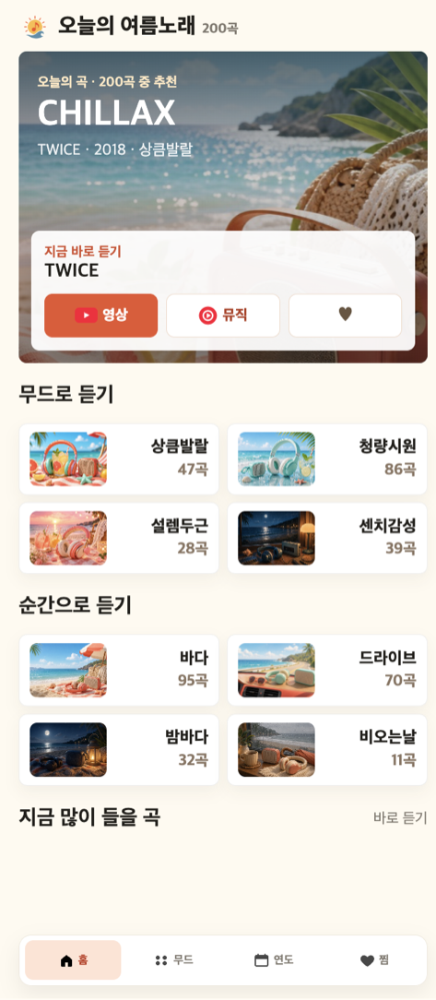
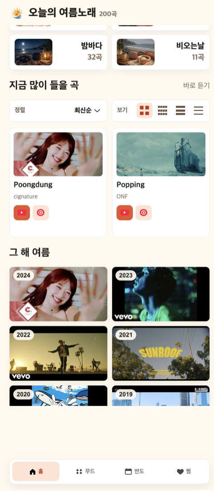
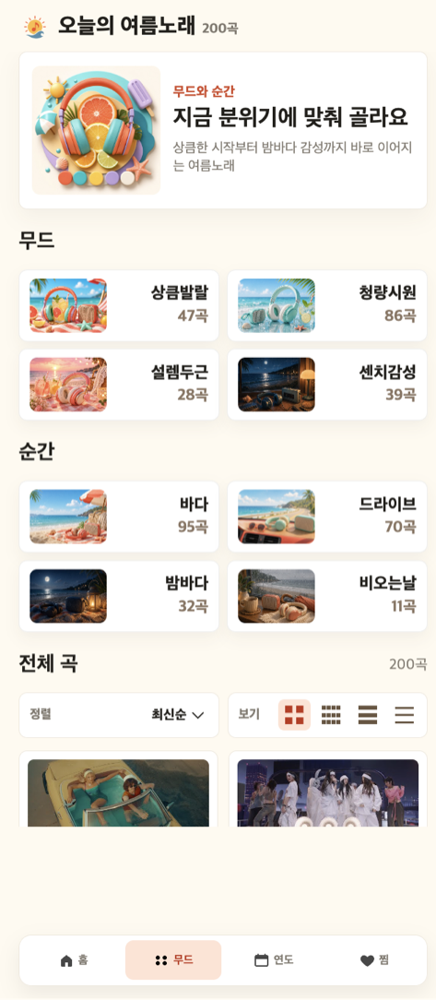
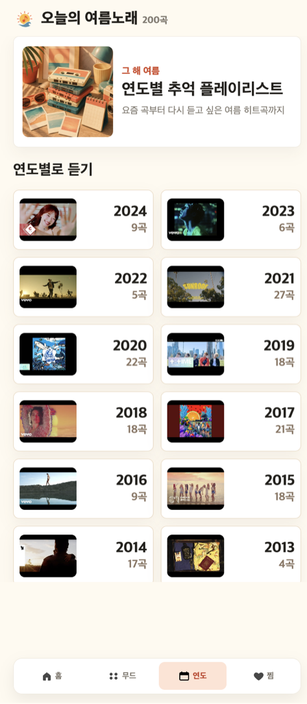
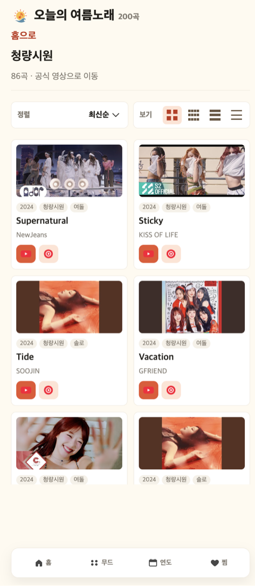

# 오늘의 여름노래 — 앱인토스 미니앱

여름노래 200곡을 큐레이션해 매일 한 곡을 추천하고 공식 영상으로 연결하는 토스 미니앱.
앱인토스 2026년 7월 바이브코딩 챌린지 출품작이며 토스 앱에서 실제로 동작한다.

**실제 앱: https://minion.toss.im/3uMxWrls**

| 홈 — 오늘의 곡 | 홈 — 추천 리스트 | 무드/순간 | 연도별 | 플레이리스트 |
| --- | --- | --- | --- | --- |
|  |  |  |  |  |

## 무엇을 만들었나

음원을 재생하지 않고 **여름노래를 발견시키는 도구**다. 200곡(1985~2024)을 무드·순간·연도 세 축으로 분류하고, 곡을 고르면 공식 YouTube / YouTube Music으로 연결한다.

- **오늘의 곡** — 접속 시각·요일·현재 날씨를 반영해 매 세션 다른 한 곡을 상단에 고정
- **무드 4종**(상큼발랄·청량시원·설렘두근·센치감성) / **순간 4종**(바다·드라이브·밤바다·비오는날) — 감정 축과 상황 축을 분리해 중복 없는 진입점 제공
- **연도별 플레이리스트** — "그 해 여름" 회상 진입점, 2024년부터 역순 정렬
- **찜** — Apps in Toss `Storage` 저장(실패 시 `localStorage` 폴백), 재접속 후에도 유지
- **공유** — `getTossShareLink`로 곡·플레이리스트 딥링크 생성, `referrer` 파라미터로 유입 경로 추적
- **뷰 모드 4단계**(2단·4단·1단·간략) × **정렬 3종**(최신·오래된·랜덤)

## 추천 로직

`src/lib/songUtils.ts`. 서버 없이 클라이언트에서 매 세션 점수를 계산해 1위 곡을 노출한다.

```
score = 세션시드 0.58 + 컨텍스트 0.22 + 최신도 0.12 + 여름적합도 0.08
컨텍스트 = 시간대 0.38 + 요일 0.22 + 날씨 0.40
```

- 세션 시드는 `날짜:crypto난수:시각:요일:날씨`를 FNV-1a 해시로 돌린 값 — 같은 날에도 재진입하면 다른 곡이 나오되, 한 세션 안에서는 결과가 고정된다
- 날씨는 geolocation 권한 + Open-Meteo API(타임아웃 1.6초)로 받아오고, 실패하면 `unknown`으로 폴백해 추천이 멈추지 않는다
- 비 오는 날은 `비오는날`/`센치감성`, 무더위는 `청량시원`/`바다`처럼 조건별 가중치를 분기
- 제목·아티스트에 `official`, `dance practice`, `fancam` 같은 메타데이터 노이즈가 섞인 곡은 오늘의 곡 후보에서 제외

## 데이터 파이프라인

큐레이션 마스터(xlsx) → 후보 수집 → 엄격 필터 → 링크 검증 순으로 200곡을 확정했다. `scripts/`에 각 단계가 남아 있다.

| 단계 | 스크립트 | 내용 |
| --- | --- | --- |
| 후보 수집 | `build_verified_summer.mjs` | 여름 플레이리스트 5종에서 트랙 추출 → YouTube 공식 영상 매칭 → `videoId` 확정 |
| 컨셉 정제 | `refine_concept_catalog.mjs` | 무드·순간 태깅과 중복 제거, ID 재부여 |
| 커버리지 감사 | `audit_spotify_summer.mjs` | 원본 플레이리스트 대비 누락곡 대조 |
| 엄격 필터 | `finalize_strict_catalog.mjs` | "여름"과 무관한 히트곡 60여 곡 제외, 계절 근거가 명시된 곡만 잔류 |
| 링크 검증 | `validate_curated_songs.mjs` | YouTube oEmbed로 전곡 생존 확인 + 곡명 불일치 탐지 |

- 모든 곡은 `videoId`만 저장하고 URL은 런타임에 조립한다 (`youtu.be`, `music.youtube.com`, 썸네일은 `img.youtube.com`)
- 각 곡에 `selectionBasis`(선정 근거)를 남겨 "왜 이 곡이 여름노래인가"를 사후 검증 가능하게 함
- 검증 결과는 `docs/phase-1-link-validation.md`, `docs/phase-4-link-validation.md`에 기록

## 정책·저작권 대응

음악 앱이라 심사 리스크가 가장 컸다. 처음부터 "음원 서비스가 아니라 큐레이션 도구"로 포지셔닝했다.

- 음원 호스팅·자체 재생 없음, 유일한 재생 경로는 공식 채널 `openURL` 연결
- 공식 MV / 아티스트·레이블 공식 채널 / Topic 채널만 큐레이션, 재업로드·팬메이드 링크 배제
- 앨범아트 대신 YouTube 공식 썸네일 사용
- 공유는 공식 SDK만 사용 (`intoss-private://` 사설 스킴 조립 금지)
- 라이트 모드 전용, CSR 전용 — `eval`, `window.location.replace`, `document.write`, `dangerouslySetInnerHTML`, SSR API 사용 0건 (`docs/reviews/phase-6-review.md`)

## 개발 방식 — Phase 하네스 + 리뷰어 게이트

Phase 0~7로 작업을 쪼개고, 각 phase마다 별도 리뷰어 에이전트가 `PASS / PASS_WITH_FIXES / FAIL`을 판정하도록 했다. `FAIL`이면 다음 phase로 넘어가지 않는 규칙이다.

- 계획: `docs/여름노래_미니앱_실행계획.md`, 화면 정의: `docs/여름노래_미니앱_디자인.md`
- phase 정의: `docs/phases/`, 리뷰 결과: `docs/reviews/`
- 리뷰어 정의: `docs/reviewer_agents.md`

지표는 `eventLog`로 9종 이벤트(홈 조회, 오늘의 곡 노출, 카드 클릭, YouTube/YouTube Music 이동, 찜 추가·해제, 공유, 플레이리스트 조회)를 수집하도록 설계했다.

## 실행

```bash
npm install
npm run dev          # granite dev — QR로 토스 앱에서 확인
npm run build        # .ait 번들 생성
npm run deploy       # 앱인토스 콘솔 배포
```

광고 그룹 ID는 `.env`로 주입한다. 개발·QR 테스트에서는 공식 테스트 광고가 자동으로 쓰이므로 비워둬도 동작한다.

```bash
cp .env.example .env
# VITE_AIT_BANNER_AD_GROUP_ID=...
# VITE_AIT_FULLSCREEN_AD_GROUP_ID=...
```

> 배포 API 키가 담긴 실제 `.env`는 포트폴리오에 포함하지 않았다.

## 폴더 구조

```
src/            앱 소스 (App.tsx 단일 화면 라우팅, lib/ 추천·공유·지표·저장)
src/data/       curatedSongs.json — 확정 200곡
scripts/        데이터 수집·필터·검증 파이프라인
data/           파이프라인 중간 산출물 + 큐레이션 마스터 xlsx
public/assets/  카테고리·아이콘·히어로 이미지
docs/           실행계획, 디자인 정의서, phase 문서, 리뷰 기록, 스크린샷
docs/store/     스토어 등록용 로고·썸네일·프로모션 이미지
```

## 기술 스택

React 18 · TypeScript · Vite 6 · Apps in Toss Web Framework(Granite) · TDS Mobile · Emotion · Node.js 스크립트(YouTube oEmbed 검증) · Open-Meteo API
